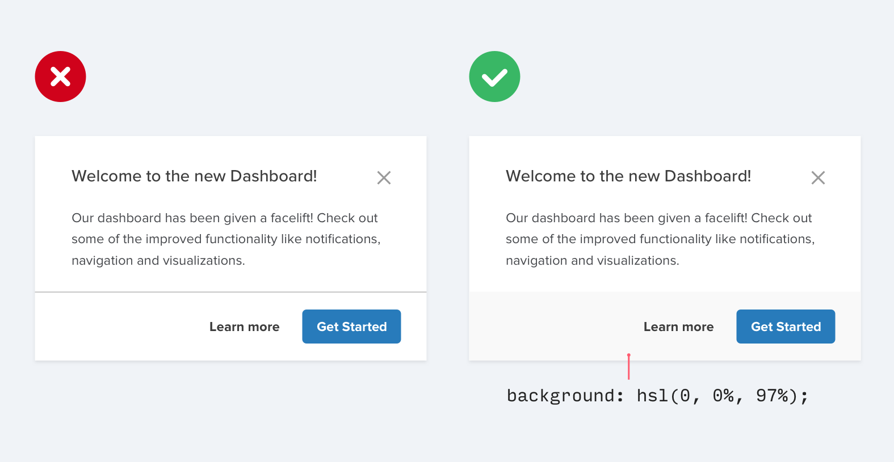
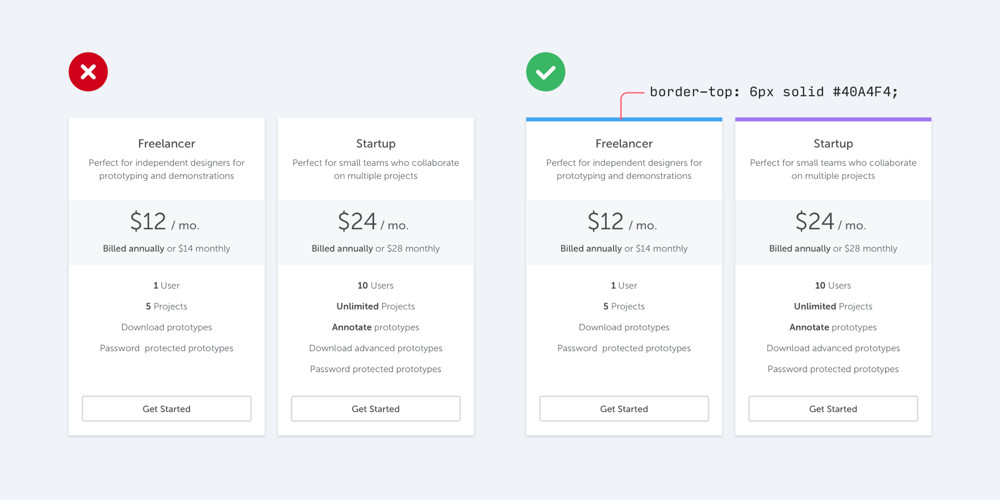
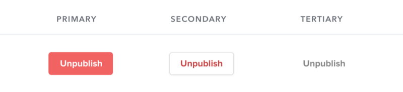

> 靠技巧而不是天赋来改进你的设计

每个网页开发者都不可避免地会遇到需要做出视觉设计决策的情况，不管他们是否喜欢。

也许你所在的公司没有全职设计师，你需要自己设计 UI 来实现一个新功能。也许你正在做一个工作之外的项目，你希望它看起来不仅仅是「又一个 Bootstrap 风格站点」，而是更好。

你很容易举手投降，「我永远不能让这看起来很漂亮，我不是一个艺术家!」但事实证明，你可以有很多技巧来提升你的作品，而不需要一个平面设计的背景。

现在，这里有七个简单的思路，你可以用来改进你的设计。

## 1. 使用颜色和字重而不是大小来创建层级结构

一个常见的错误是在设计 UI 文字时过于依赖字体大小来控制层级结构。

「这段文字很重要吗？让我们把它变得大一些。」

「这段文字是次要的吗？让我们把它变得小一些。」

与其把所有的强调都留给字体大小，不如尝试使用颜色或字重来做同样的工作。

「这段文字很重要吗？让我们把它变得粗一些。」

「这段文字是次要的吗？让我们使用浅一些的颜色。」

试着坚持两到三种颜色：

* 黑色（但不要纯黑） 用来显示主要内容（如文章的标题）
* 灰色 用来显示次级内容（如文章发表的日期）
* 浅灰 用来显示辅助内容（如页脚上的版权信息）

类似地，两种字重对于 UI 设计通常已经足够。

* 正常字重（400 或 500，取决于字体） 大多数文字
* 更重的字重（600 或 700） 你想强调的文字

在 UI 设计中，远离 400 以下的字重。它们可以用来做大标题，但是在较小的尺寸下难以阅读。如果你正在考虑使用更轻的字重来弱化一些文字，倒不如使用一个更浅的颜色或更小的字体。

## 2. 不要在有色背景上使用灰色文字

在白色背景上用浅灰色文字来达到弱化文字效果是一种很棒的方式，但在有色背景上这不是一个好主意。

这是因为实际上我们看到的白背景上灰色文字的效果是对比度的降低。

使文字更接近背景色实际上有助于创建层级结构，而不是让它变成浅灰色。

有两种方法可以降低有色背景下的对比度。

1.  减少白色文字的不透明度  
    使用白色文字，降低不透明度。这样可以让背景颜色透一点点，以一种与背景颜色不冲突的方式去弱化文字。

    

2.  手工挑选一种基于背景色的颜色  
    当背景色是图片或纹理，或者当减少不透明度使得文字过于乏味或有被冲掉的感觉时候，这种方法比减少不透明度要好。

    

选择和背景色相同的颜色，调整饱和度和亮度，直到它看起来适合你。

## 3. 偏移阴影

不要使用大的模糊和扩展值使框影更加明显，添加一个垂直偏移。

它看起来更自然，因为它模拟了从上面照下来的光源，就像我们在现实世界中看到的那样。

嵌入阴影也同样适用，比如在表单输入框这种情形。

如果你有兴趣了解更多关于影子设计的知识，那么 `Material 设计指引`是一个很棒的入门。

## 4. 少用边框

当你需要在两个元素之间创建分离时，不要立即就想用边框来解决。

虽然边框是区分两个元素的好方法，但它不是唯一的方法，使用太多的边框会让你的设计变得拥挤和混乱。

下次当你想要用边框时，试试这些思路中的一个。

1.  使用边框阴影  
    边框阴影很好地绘画了一个像边框一样的元素，但是更加微妙，起到相同的效果而又不会分散注意力。

    

2.  使用两种不同的背景颜色  
    为了区别相邻元素，你所要做的就是给相邻元素稍微不同的背景颜色就够了。如果你已经使用了不同的背景颜色，又额外使用了边框，尝试移除边框，你可能不需要它。

    

3.  增加额外的空间  
    还有什么比简单地增加空间更好的方法来建立元素之间的分离？在不引入任何新 UI 的情况下，进一步增加各元素之间的空间是一种很棒的方法来达到区隔效果。

    

## 5. 不要放大那些本来就很小的图标

如果你正在设计的部分需要用到大图标（比如「着陆页」的「特色」部分），你可能会本能地去找一个免费的图标集，比如 `Font Awesome`或`Zondicons`，然后把尺寸放大，直到它们适合你的需要。

它们毕竟是矢量图像，所以如果你增加尺寸，质量就不会受到影响，对吧？

虽然你增加矢量图像的尺寸时矢量图像的质量不会降低，但当你把图像放大到 3x 或 4x 时，原本在 16-24px 处绘制的图标看起来永远都不会非常专业。它们缺乏细节，总是感到不成比例的「粗大」。

如果你只有一些小图标，试着把它们包裹在另一个形状中，并给形状一个背景颜色:

这样你就可以让实际的图标更接近它原本预期大小，同时仍然填充更大的空间。

如果你有预算，你也可以使用一个设计用于更大尺寸的高级图标集，如 `Heroicons` 或 `Iconic`。

## 6. 使用特色边框为平淡的设计增添色彩

如果你不是一个平面设计师，你如何将其它设计从美丽的摄影或色彩丰富的插图中获得的那种视觉风格添加到你自己的 UI 中呢？

一个简单的技巧可以带来很大的不同，那就是在界面的某些部分添加色彩鲜艳的边框，可避免乏味。

例如，在一个警告消息的边侧：

或者突出导航目录的激活条目：

甚至是整个布局的顶端：

为你的 UI 添加一个彩色矩形不需要任何平面设计天赋，而且它可以让你的网站「设计感」更强。

挑颜色很难吗？试试 `Dribbble` 的颜色搜索，它调色板的颜色有限，可避免被传统颜色选择器无穷无尽的可能性搞晕。

## 7. 不是每个按钮都需要一个背景颜色

当用户在页面上有多个操作选项时，很容易掉入一个陷阱，那就是这些操作单纯基于语义而设计。

类似 Bootstrap 这样的框架通过给你一个语义样式的菜单来鼓励这一点，每当你添加一个新的按钮时:

「这是一个肯定的操作吗？让按钮变成绿色。」

「这会删除数据吗？让按钮变成红色。」

语义学是按钮设计的重要组成部分，但是有一个更重要的维度通常被遗忘: 层级结构。

页面上的每一个操作都处于重要性的金字塔中。大多数网页只有一个真正的主要操作，几个不太重要的次要操作，还有一些很少使用的第三等级操作。

在设计这些操作时，处理好它们在层级结构中的位置是很重要的。

* 主要操作应该显而易见。强烈的、高对比度的背景色是首选。
* 次要操作应该清晰但不突出。带边框或低对比度的背景色是很好的选择。
* 第三等级操作应该不引人注目，能被发现即可。把这些操作设计成链接通常是最好的方式。

「那破坏性的操作呢，难道它们不应该永远是红色的吗？」

不一定！如果破坏性操作不是页面上的主要操作，那么最好给它一个第二或第三等级按钮的处理。

当否定的操作实际上是一个主要操作时，比如在一个确认对话框里，那么使用大的、红色的、醒目的样式就很有必要。

> 译注：          
> 对每一条规则都有争议，这是难免的。比如第二条，让文字接近背景色，这是通过降低对比度来增加美感，但有可能降低可读性。有一个网站大力反对低对比度：[CONTRAST REBELLION](http://contrastrebellion.com/)

原文：[7 Practical Tips for Cheating at Design](https://medium.com/refactoring-ui/7-practical-tips-for-cheating-at-design-40c736799886)
