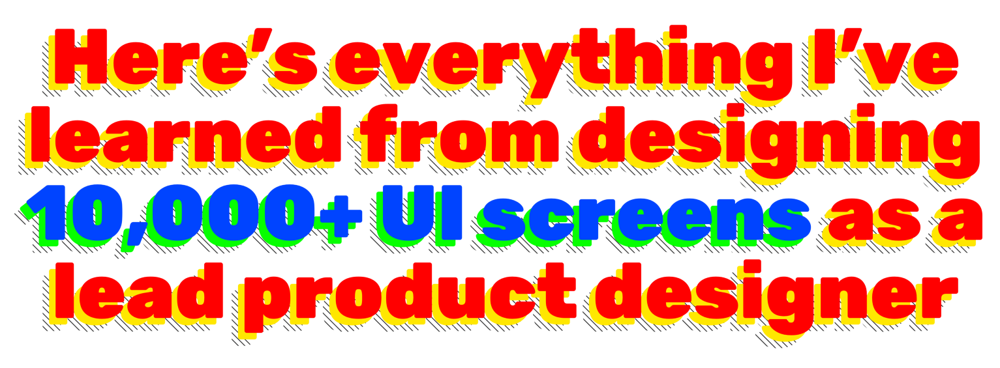
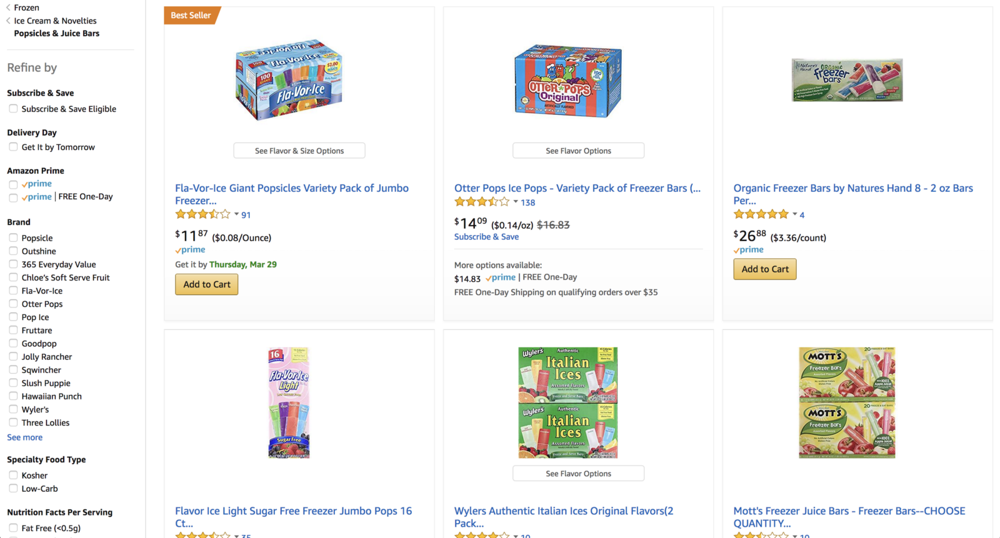
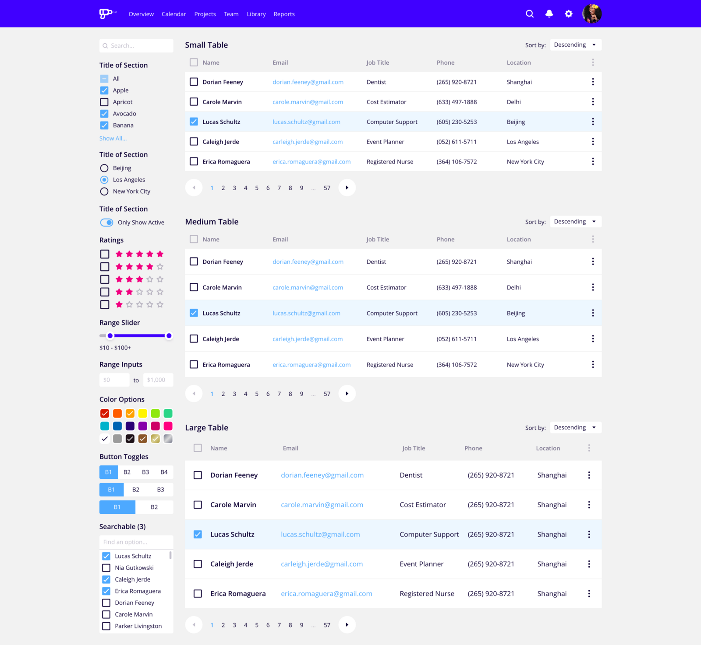
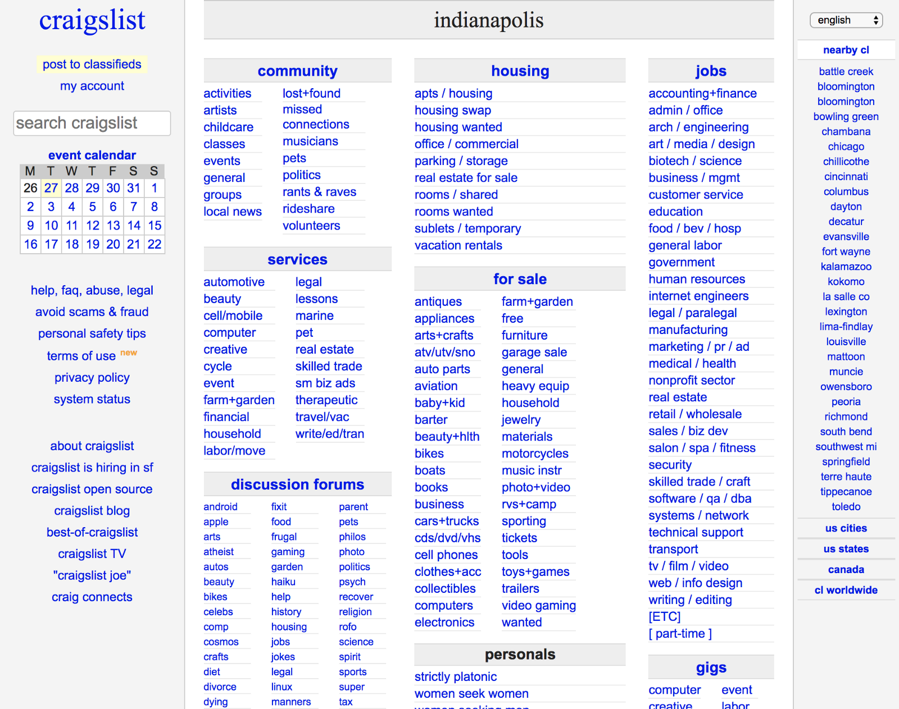

## 1. 分清设计的轻重缓急

我总是用这个类比：

> 没有人在乎你的高级概念车的皮座上的缝合是什么颜色，如果它还没有车轮的话。

分清设计的轻重缓急，首先去满足基本需求。然后，**只有这样**，你才能加入更多有趣的东西，比如自定义插图和动画。

这便于引导我们进入正确的轨道。

## 2. 没人关心动画

对不起，各位，这是真的。我并不是因为自己不擅长这个(这也是事实)，出于怨恨才这么说。

世界级的产品几乎完全没有动画效果:

**Facebook. Salesforce. Medium.**

这些产品价值数十上百亿美元，因为它们解决问题和提供价值，而不是因为它们有可爱的动画。

是的，在某个时点某个区域需要引入动画，通过一流的用户体验来传递卓越的价值。此时，你开始为之努力。然后你可以把所有的时间都花在制作一个可爱的小菜单按钮上，这个按钮会演变成麦当劳的巨无霸。

## 3. 不要重新发明轮子

_不要重新发明轮子，你就有更多时间和精力去设计宇宙飞船。_

模式是在类似的对象中发现的共有的东西。

设计模式被称为 `模式`，因为它们遍布各个场景。用户习惯于以某种方式做事，而这通常伴随着对用户体验的期望。

我可以为你设计一百种不同的方式来过滤数据表，但是没有哪个像每个电子商务网站上都有的左侧栏复选框那样有效。

不要把时间花费在那些不需要被重新发明的东西上。

## 4. 「模版化」你的作品

本着不重新发明轮子的精神，为自己制作一些设计模板。

你可以节省成吨的时间。

在一周半的时间里，为了帮助客户做一个重要的销售展示，我为他们设计了 52 个界面，并都用 `InVision` 做成了可点击的原型。为了适应客户品牌调性，整套设计完全定制。如果没有模板来帮助我启动工作，这是不可能完成的任务。

下面是一个示例界面，来自我的私人 UI 模板，我在每个项目中都使用它作为开始。

_使用 UX Power Tools 中的元素构建_

你可以看看我在 UX Power Tools 上建立的一些设计系统，我觉得他们会很好地帮助你。

## 5. 一致性产生效率

你设计得越一致，你就会越快。

我怎么知道？

重要的一点：你大大减少了你必须做的设计决策的数量。

如果你在 `Sketch` 中给自己做一个按钮模型，并在整个设计中使用它，不仅你的所有按钮看起来一致，而且突然之间你的工作效率会大大提高，因为你不是每次需要按钮的时候都从头开始制作一个。

惊天动地，我知道！

## 6. 效率产生一致性

一致性和效率是公生的，所以反过来说也对。

为了更快地工作，你必须为自己找捷径。这些捷径可以是有形的东西，比如设计资源。也可以是无形的东西，比如建立和遵循一系列的设计原则（8px 的网格系统就是）。

当你变得更快，一致性自然会随之而来。

## 7. 商业和用户价值压倒一切

据最新估计，Craigslist 市值约为 30 亿美元。

你见过那个网站吗？太可怕了。

但这并不重要。它解决了一个问题并给用户带来了价值。

简单明了。就像 Craigslist 一样！

听着，我不是在提倡设计过于简单化。我想说的是，如果你能给用户带来价值，你就会创造出能够为企业带来价值的客户。

为正确的人解决正确的问题，你就会获得成功。

## 8. 我不是世界的中心

在产品设计过程中还有**很多**其他人很重要。

我写了一个系列文章：

1.  为谁设计？为买进而设计  
    谁最终购买了你的设计？
2.  为谁设计？为生产而设计  
    谁来帮助你开发你的设计或想法？
3.  为谁设计？为质量和标准团队而设计  
    等等，我还没说完呢。谁来保证这个计划真的如预期的那样运作？

## 9. 伟大的设计会因为糟糕的展示而失败

你是否曾经和一个超级性感的人约会，但发现除了她的生活琐事，你们无法进行真正的谈话？

仅仅视觉效果并不能让一个伟大的设计深入人心，我认为视觉效果实际上只占整个演示过程的 20%。

剩下的呢？

讲故事。如果你不用一个引人注目的故事吸引你的听众，展示商业价值，并代表用户发言，那么你就会失败。

失败是什么样子的？

很多问题。设计防守而不是设计进攻。设计牺牲。缺乏信任。对投入市场焦虑。

你不想要这些东西。

## 10. 让设计变成现实

我把这个留到最后，因为它非常非常非常重要。

**实用的产品 > Dribbble 里的设计**

其它都不重要。

> 漂亮的设计？**真棒**  
> 但没有成品？**失败**

我是不是在说，为了被认为是一个成功的设计师，你必须要真正设计出能够被建造的东西？老实说，是的，算是吧。你谈论你为你配偶生日制定的计划，但没有执行到底，这不能阻止你在下个月不得不睡在沙发上。

让设计变成现实。

即使它很粗糙。即使它不完美。即使没有人使用它。

至少你坚持到底，并且学到了一些东西。

原文：[Here’s everything I’ve learned from designing 10,000+ UI screens as a lead product designer](https://medium.com/ux-power-tools/heres-everything-i-ve-learned-from-designing-10-000-ui-screens-as-a-lead-product-designer-7d2810bee810)