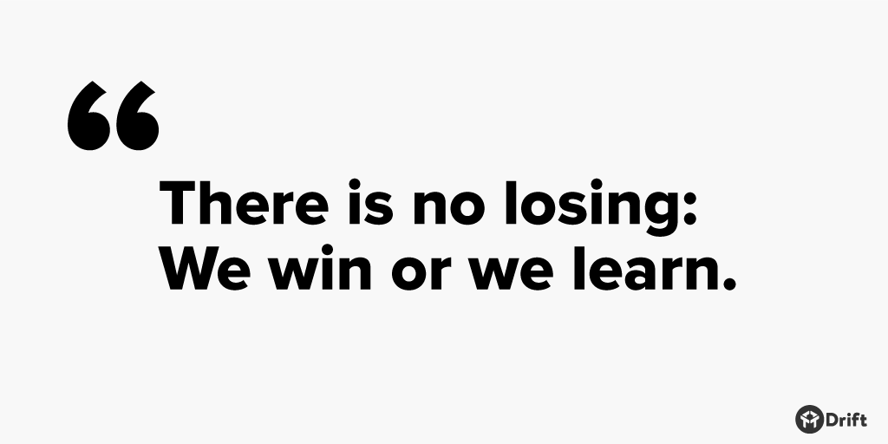

这些年我学到关于定价的一件事：它始终是一个话题。

大多数以产品为重点的公司——不管是 SaaS 公司，还是硬件公司——都会不停地思考价格和价值。

在 Drift 也是如此。

我们一直在思考价格和价值的问题，每个月在公司会议上都是话题。

这些会议给了我们一个机会，让大家作为一个团队聚在一起。我们坐下来，讨论优缺点，谈论发生了什么，能学到什么，以及如何改进。

在此过程中，我们要么赢，要么学到东西，这里没有失败。

_没有失败，要么赢，要么学到东西_

在我们上次的会议中，一个重要的话题是——对，你猜对了——定价。

我们讨论了现代企业应该如何定价它们的产品——我分享了一个例子，关于我们 Drift 团队内部使用三个产品的故事。

## 1. Trello

在我的第一个例子中，我向团队展示了一张我刚从 Trello 收到的账单。也许你不知道 Trello，它是一个伟大的产品管理工具。我们使用它，我们喜欢它。我们的产品经理马特是个超级粉丝，他愿意为 Trello 出点血。

但我还是不得不问团队：「你们知道这张 Trello 的账单多少钱吗？」

然后我放上幻灯片：每年 1700 美元。

哇喔。

> 背景信息：我们 Drift 只有大约 20 个人。

尽管我们所有人都使用 Trello，但大多数人只是被动地使用它，只有几个人每天必用。

然而，与此同时，我们付费的依据是我们在付费计划中拥有的人数。所以很明显，我们付出的价格和我们得到的价值之间存在脱节。

现在，谈到定价，Trello 做了一件伟大的事情——这是 Slack 做的，也是我们 Drift 做的事情——如果你有一定数量的用户或联系人没使用服务，我们会把它从你的账单中删除。因为我们相信公平的计费，我们不会因为你没使用的东西而收费。

但是，尽管 Trello 有这样一个公平的定价方案，1700 美元的账单还是引起了我的注意。

于是我把这张账单递给马特(Trello 超级粉丝) ，我问他:「我们应该付费吗？」

马特出去和我们的产品设计师讨论了这个问题，回来的时候，他们建议应该降级到免费版的 Trello。

## 2. Slack

差不多同一时间，我收到了 Slack 的账单。

我们使用 Slack，我们喜欢 Slack，就像我们喜欢 Trello 一样。

所以我用大约 1300 美元支付了一年的费用。在收到这个账单的时候，我立刻对自己说：

「付钱！」

我想：「这太便宜了，这太棒了。」所以我付了钱，我很乐意付这个钱。

我甚至愿意付三倍的钱（不过请 Slack 不要这么做）。

为什么？因为我看到了价值。

我们每天都在业务中使用 Slack，作为一个内部工具，我无法想象它会消失。

相比之下，Trello 是我们从品牌角度来看最喜欢的。我们都是它的粉丝，我们都使用它(不像 Slack 那么多，但是我们使用它)。然而，即便是马特-——这个超级粉丝——也建议，我们应该降级到免费计划。

他建议降级是因为我们没有用到那些付费功能。

在我们付出的价格和得到的价值之间存在不一致。

这让我想起了 Leadpages 联合创始人兼 CEO 克莱•柯林斯的一段话：

> 大多数 SaaS 企业都是按照健身房会员制模式经营的: 他们的大部分钱来自那些几乎不使用产品却懒得退出的客户......事实上，如果每个会员每周都来一次，大多数健身房都会倒闭。他们的整个体系依赖于非消费。

今天有些公司甚至不会每个月给你寄账单-——他们直接从你的信用卡扣费。他们并不真的在乎你是否在使用他们的产品，他们会一直收费，直到某天你愤而退出。

我们已经思考了很多，关于我们希望 Drift 做什么样的生意，我们希望与客户建立什么样的关系——以及我们希望 Drift 的定价模型如何反映这一点。

最终，我们希望建立一个定价模型，使得我们与客户的成功保持一致-——我们不能从甚至没有使用过我们产品的人身上赚钱。

这就是为什么我们在 Drift 有一个免费计划，我们想把非消费部分从账单里去掉。

我们只想向那些通过使用我们的产品而取得成功的客户收费-——而且我们想根据他们成功的大小来调整费用。

## 3. FullStory

除了 Trello 和 Slack 之外，我在上次团队会议上提到了第三家 SaaS 公司: FullStory。

马特和我们的产品设计师埃利斯是两个最大的 FullStory 粉丝。

每个月，我们从 FullStory 那里得到一张 200 美元的账单。

因此，每年 2400 美元——这比 Slack 还要多，比 Trello 还要多。

但是不像 Slack 和 Trello，我们团队中只有两个人使用 FullStory，因此我不确定它的价值。

所以每个月，我都会给马特和埃利斯发邮件，问他们:「你们还需要 FullStory 吗？」

每个月他们都会回答:「当然了。」并且告诉我，如果公司不支付，**他们会自己付钱**，因为他们非常喜欢它。

这里的重点在于 FullStory ——尽管马特和埃利斯发现它非常有用——它带来的价值对整个组织来说并不明显。所以我每个月都要问这个问题——但是答案是显而易见的。

## 最后的想法

随着公司的发展，我们正在思考如何使我们的价格与提供给客户的价值保持一致。

我相信随着我们学习越多，受教育越多，我们的价格也会不断变化。但是，我们希望发展这种模式——我们认为越来越多的新企业将转向这种模式——将非消费业务从账单里去掉。

软件正在朝着免费的方向前进。因此，你真的应该只对那些积极使用它并从中获得价值的人收费。

对于消费者来说，这是一个很好的模式，因为价格和他们的成功是一致的。从销售的角度来看，这也很棒，因为你不会吸引那些不消费的客户。毕竟，那些不消费的客户是最有可能流失的。

在新模式下，我们希望帮助那些在免费计划上举手的人升级，这意味着他们已经在积极使用我们的产品，然后他们举手要求更多的功能。

所以在 Drift，我们希望雇佣非传统的销售人员，我们正在寻找专注于帮助他人的销售人员。

_帮助他人是新型销售_

正如客户参与是新型营销，帮助他人就是新型销售。这意味着销售人员，以及销售模式都必须改变以适应这种情况。

原文：[How We’re Thinking About Pricing](https://blog.drift.com/how-to-price-your-product/)
