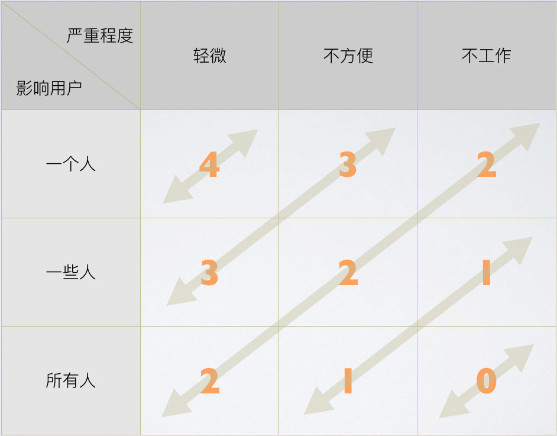

> 我们有时忘了软件的目的。

程序员似乎忘记了软件真正的目的，那就是解决现实世界的问题。

50 年前，在 1968 年，由北约科学委员会主办的`软件工程工作会议`举行。从那时起，人们开始注意到软件正在成为社会的基本组成部分，同时，它也变得越来越难以理解。会议结束后，编程成为一个整体产业，开始远离商业人士的控制。

不管自那时以来程序设计的走向如何，商业和软件开发（或者说是会议第一次称呼的「软件工程」）之间的分离仍然存在问题。如果开发人员过于狭隘地关注开发，他们就会错过他们编写的软件的真正目的，他们可能看不到无需任何代码的隐藏解决方案。

这儿有一个例子。

有一家创业公司正在研发一种设备，该设备允许人们使用蓝牙打开他们家的门。与设备交互的界面是一个小部件，即使在手机锁定的时候也是可见的。它有一个单独的按钮，叫`开门`。

当用户走近房子时，他们会拿起电话，找到小部件，然后点击按钮开门。

有人看了这个工作流程后，问：

> 如果我们使用蓝牙，而且商业模式里允许任何拥有手机的人都可以进入房子，那为什么我们需要让人拿起电话并按下按钮呢？当门监测到设备接近 1 米的时候，可以直接打开门，这样我们就不需要花钱去设计和编码交互界面了。

蓝牙的故事是一个极好的聚焦问题的例子：目标是尽可能简单地打开门，如果传感器是无线的，设计一个视觉界面就没有意义。

如果你知道企业想要实现的目标以及对用户的价值，你可以将这些知识与你掌握的技术可能性的知识结合起来。只有这样，你才有足够的信息做出更好的判断，并得出结论，交互界面对该产品是不必要的。

这是一个很好的例子，说明如何**不写额外的代码**而解决一个编程问题，实现解锁功能。无论如何，就像技术债务一样，没有任何东西能作为借口来写垃圾代码。

记住：**并不是每一行代码都值得编写。**

有时，修复一个严重的漏洞并不是一个优先事项。假如你从事  加密货币  交易，你们的  系统偶尔会发生重复存款，如果解决这个问题的成本很高，人工干预可能是性价比最高的解决方案。

严重性和优先级之间的权衡让我想起了一位同事最近向我展示的一个模型。它被称为`优先级矩阵`，这是一个二维模型，可以根据 bug 影响的用户数和严重程度一起决定处理的优先级。0（让所有人都不工作） 为最高优先级，4（对个别人有轻微影响）为最低优先级。

_「影响用户数-严重程度」的二维优先级矩阵_

前面描述的单个用户重复存款问题属于`一个人-不方便`这个分类，因此，优先级为 3。

记住：**并不是每一个 bug 都值得修复。**

对于开发人员来说，尝试为所有东西编写脚本是很常见的。然而，一些可重复的任务可能不值得自动化。如果你不希望隐藏底层命令如何工作的基本知识，就不需要花费时间来编写脚本。

复杂逻辑的封装和有用知识的抽象存在区别。有时，信息应该被明确地表达出来，以便可以理解。如果你把它们进行抽象，会产生相反的效果，反而更难理解。

在 CLI（命令行交互界面）中，使用某些类型的低级命令比使用抽象化知识的高级命令（比如 GIT 别名）更有用。

记住：**并不是每一个命令都值得脚本化。**

几年前，我参与了一个递增交付的项目。这是一个身份核查系统，要求用户提交一些个人数据，供第三方核实。团队想要做一个复杂的表单验证功能。然而，随着最后期限越来越近，每个子计划都会降低这个功能的优先级。最后，大家发现，这个复杂的验证功能根本没什么意义。

原因如下：验证是强制性的。

提供有效的信息符合用户的利益。如果用户提供了错误的数据，他们就不会被验证，也不能使用该系统。此外，大多数浏览器都支持标准的 HTML 验证，这已经足够好了。

考虑最糟糕的场景，用户无法自行验证，他还可以申请人工验证来解决问题。

记住：**并不是每一个功能都值得实现。**

作为一个开发人员，如果你能理解你试图解决的问题，你就能够写出更好的代码，有时甚至根本没有代码。你不是一个受雇在屏幕上输入字符的代码猴子，你是一个解决问题的专家。

然而，如果你把代码当作万能的「银弹」，试图不假思索地用技术解决每一个问题，那么你很难理解什么能给客户带来价值，也难以提出伟大的想法。

你的目的，你撰写的代码的目的，是创造价值，让现有世界变得更美好，而不是满足你「世界应该是什么」的以自我为中心的看法。

有句谚语说：「如果你只有一把锤子，那么所有东西看起来都像钉子。」

最好先有一枚钉子，然后再考虑是否需要锤子。

也就是说，如果你首先需要钉子的话。

原文：[The Problem You Solve Is More Important Than The Code You Write](https://levelup.gitconnected.com/the-problem-you-solve-is-more-important-than-the-code-you-write-d0e5493132c6)
