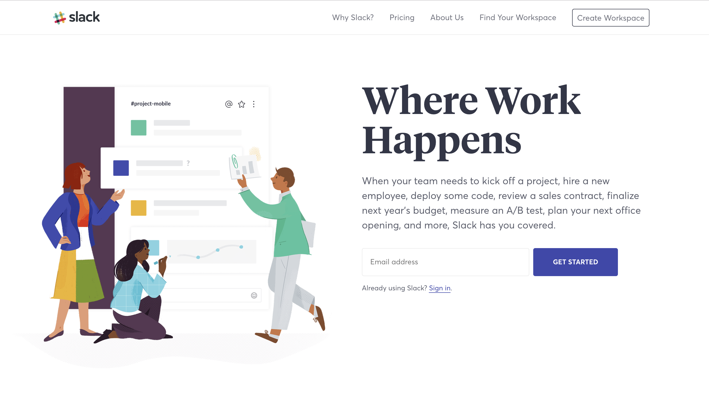
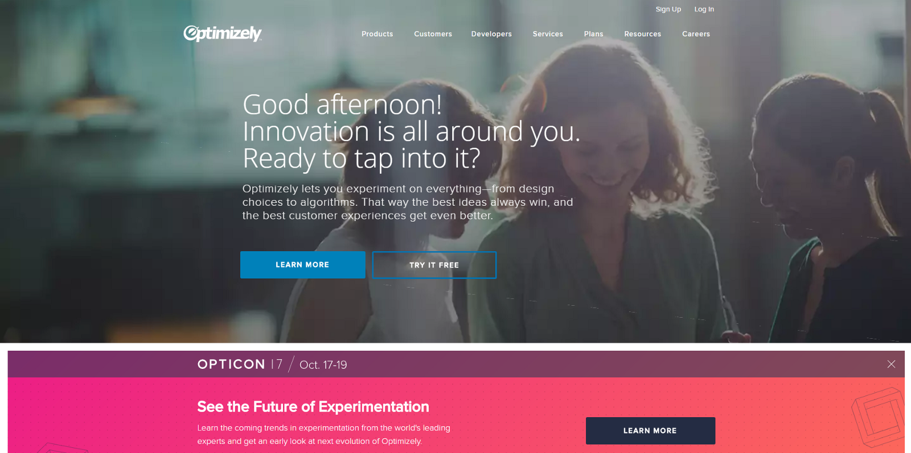
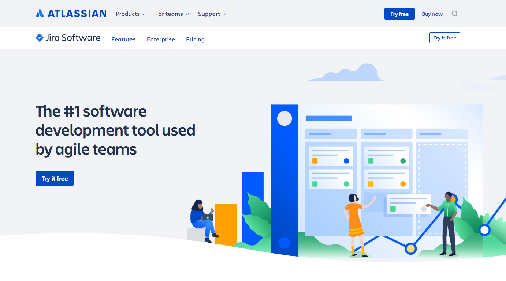
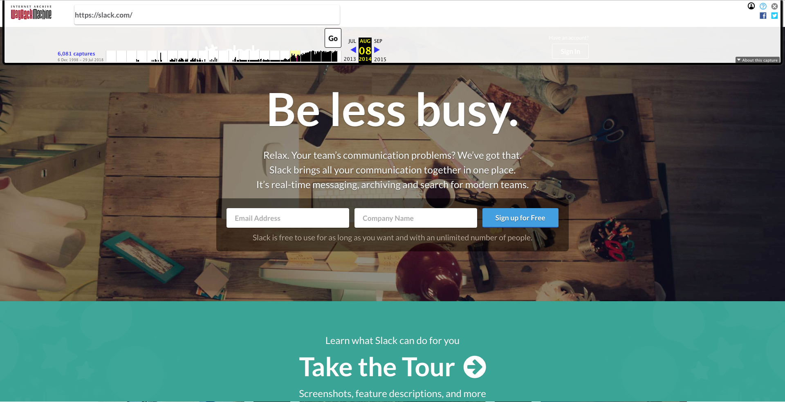
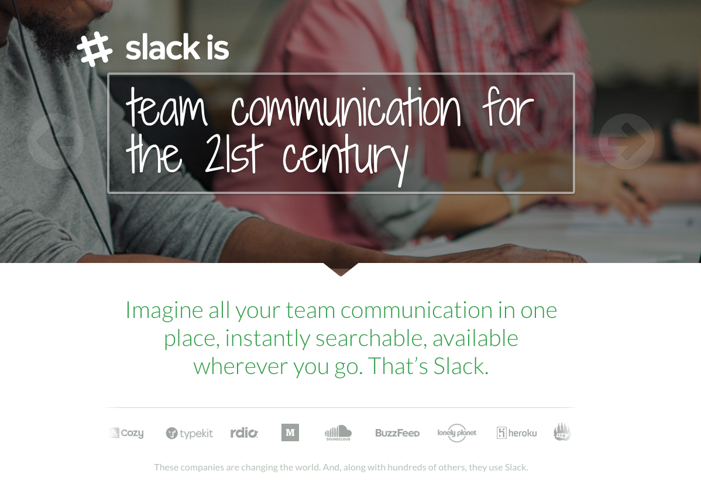
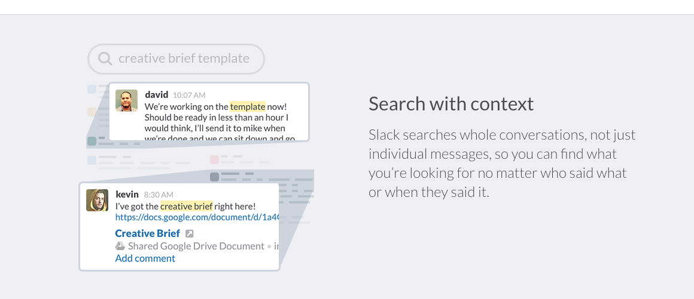
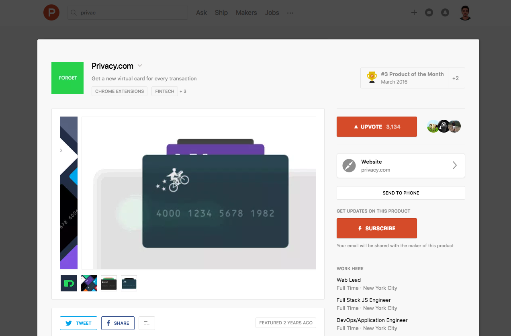
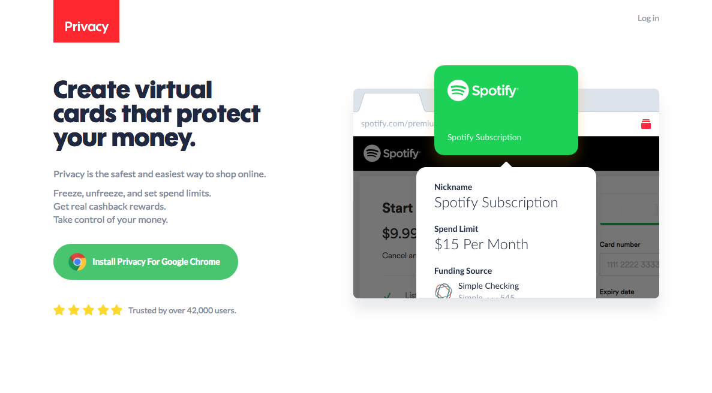

## 基础知识

以大公司的网站为参考会把你带入歧途，要小心！

在这篇文章中，我将告诉你为什么不应该看绝大多数大公司的网站，你的网站应该包含什么，以及如何为你的网站找到好的参考。
你知道，这些公司在他们专长的领域更为知名，他们不需要解释所有的事情，也不需要靠网站来获得所有的销售线索，而这恰恰与你现在的需求完全相反。

以下是为什么大公司「糟糕」的网站仍然工作得很好的原因：

- 人们可能已经知道他们是谁，他们在做什么。这不是网站的功劳，它来自多年的市场营销
- 他们拥有更多的资源，他们不依赖网站来获取大部分销售线索
- 他们可以使用付费流量来保持一个昂贵的销售漏斗，哪怕转换率只有 0.0001%，他们可以承受失败和尝试的后果
- 他们可能有很多销售人员在完成网站无法独立完成的交易
- 即使他们做了大量的测试，他们针对的也是自己的场景，不是你的

不幸的是，如果你不是一家大公司，或者没有大量资金，以上这些都没用。

## 你可能喜欢但对你毫无用处的网站

尽管其中一些网站设计得很好，但他们们并没有清楚地说明产品如何工作，以及如何处理潜在客户可能持有的反对意见。

你真的不应该以他们为榜样，下面看三个例子。

### Slack

这个页面不能解释 Slack 是什么，它如何工作，它多么有价值，事实上，如果你在下方添加上 logo，这几乎是他们的整个着陆页面。

他们可以这么做，因为太多人已经知道 Slack 了，这个页面只是一个简单的注册表单。

### Optimizely

这是什么？

看看这个大标题，你知道他们做了什么吗？

如果你也这样做，你将得到超过 90% 的客户流失率。大多数访客不会继续浏览下面的内容，一次客户转化机会就没有了。

### Jira

不要使用「我们在 XX 领域是第一」，尤其在起步的时候。

我不相信有谁会继续看下去，对于那些严肃的潜在客户来说，这听起来就像是在胡扯！

看看这些文案，没有解释产品解决方案的价值，也没有定义正确的客户预期，这是你能犯的最大的错误之一。

然而，如果你赢得任何奖项（或类似的东西），你应该在页面中提及，因为是其他人说你的产品是第一名，而不是你自己，这是真正的社会证明。

## 你的网站在早期阶段需要什么

- 解释它是什么，它如何工作，它为何有价值，以及人们为什么现在就应该尝试/购买它
- 通过让你更快更有效地测试市场或新的计划/服务，帮助你提高产品对市场的适应性。你不必担心问题是源于是否契合市场还是源于没有正确地转化，这样你可以节省几个月的时间。
- 能够充分解释你的产品，让潜在客户进入下一阶段，比如，一个销售电话，一个注册，一个免费试用或任何你可能想要的其它形式的销售线索
- 回应潜在客户的反对意见
- 以一种可扩展的方式复制第一个客户的购买体验
- 让你专注于产品和营销，如果网站有流量，它就会带来商机

## 如何为你的网站找到好的参考

### 着陆页面的灵感

我推荐 [lapa.ninja](https://www.lapa.ninja/)，因为它有很多分类，你可以方便地在线查找。

你该怎么做？

- 只有那些真正需要通过他们的网站来获得销售的公司才可以参考
- 试着在你登录页面的同一类别中搜索页面，这样你就有机会在评论里分享你的观点

观察那些你不认识公司的网站，看看你是否能理解他们的工作。如果你清楚地知道网站的哪些地方让你理解了他们提供的价值，你可以在自己的网站上也实现它。

### 使用时间机器

我们可以看看 2014 年 8 月的 Slack 长什么样。

看！也许看起来不那么干净漂亮，但当时他们努力解释了 Slack 如何提高团队生产力。

让我们再来谈谈 Slack，看看这个 [更详细的解释](https://web.archive.org/is/team-communication)，关于 Slack 如何工作，如何做得更好。

你该怎么做？

- 弄清楚他们什么时候发布的，看看他们是如何推广的
- 注意网站的发布和获得一些认同之间的区别。如果你搜索一家知名公司，你甚至可以搜索一些文章来了解更多当时发生的事情。

### 在 ProductHunt 上看那些好的网站如何发布

看看 Privacy.com。

_3134 赞成票！人们理解它的价值_

_非常清晰的网站_

如果人们为它投了赞成票，那是因为他们理解网站提供的价值，并且对推广它感到特别的兴奋。

**警告：**忽略大公司或著名人物的发布，他们很容易获得更多的赞成票。**「新的和即将到来的（New and Upcoming）」类型对你来说才是理想的参考！**

原文：[Stop Looking at Websites from Bigger Companies for Reference, It Doesn’t Work! + How to do it](https://www.indiehackers.com/@pedrocortes/011a186c95)
