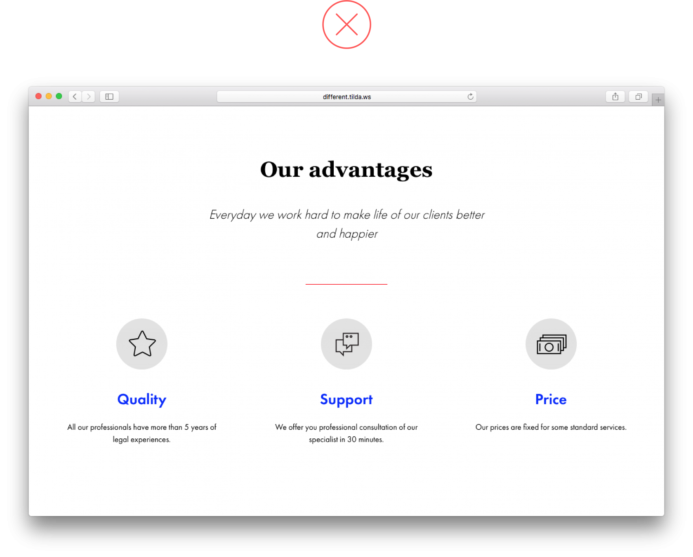
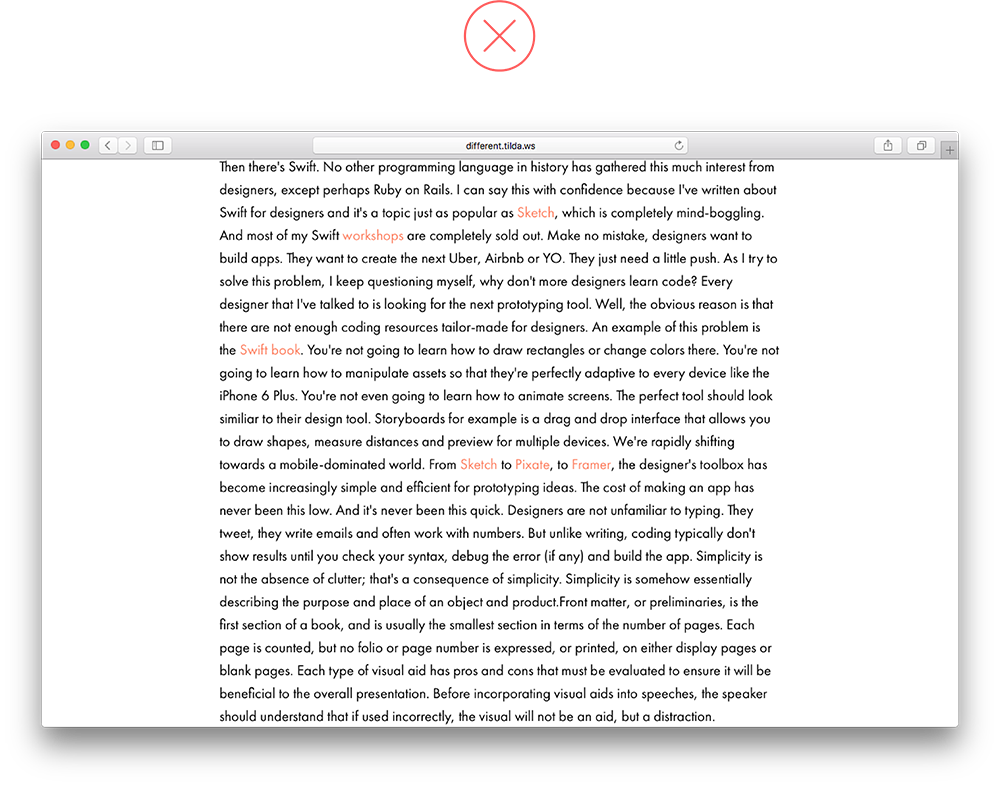
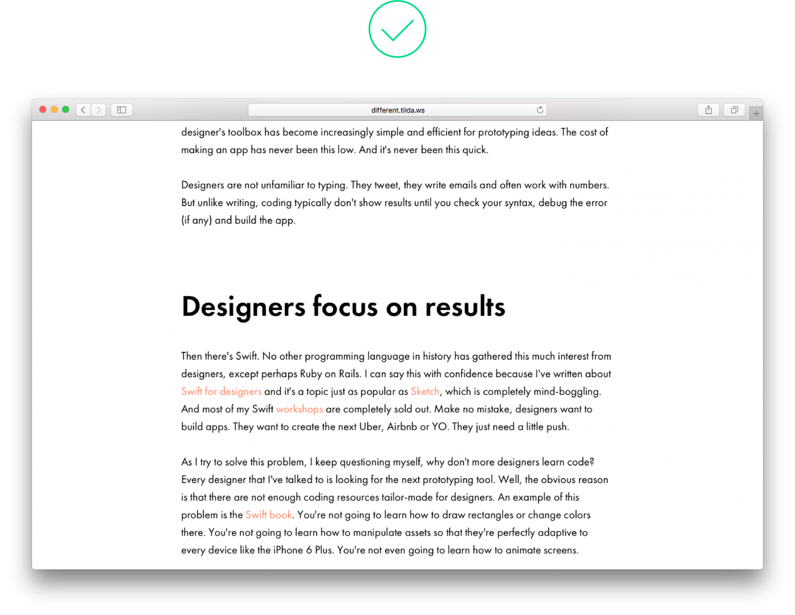
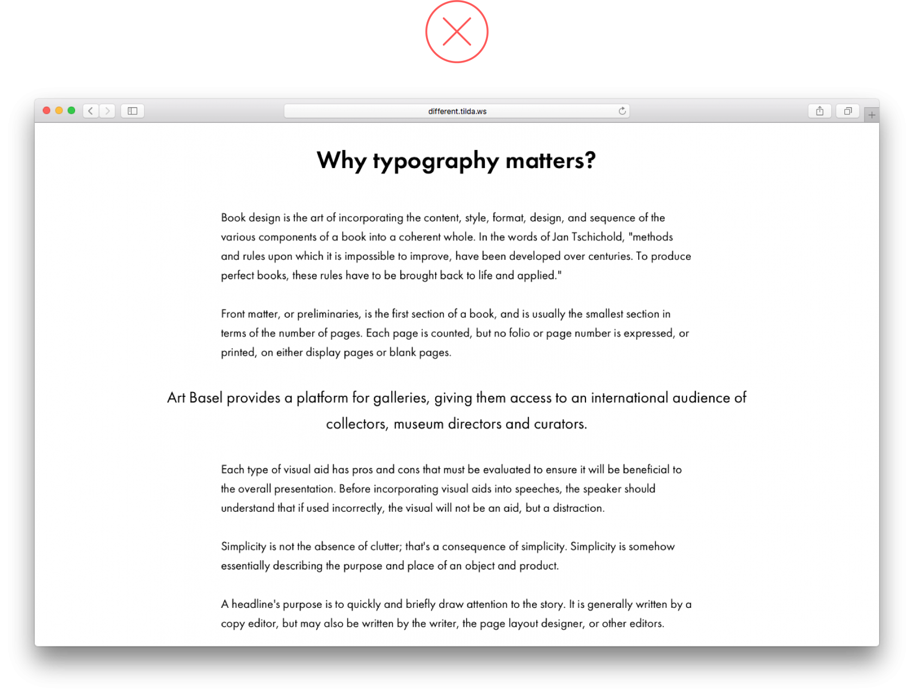
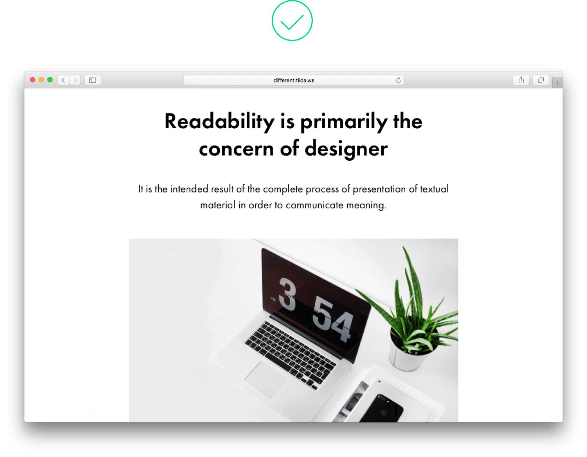

> 第一部分：常见的着陆页设计错误

## 1. 内容没有按逻辑分块

如果将内容分组成逻辑块，用户会更容易理解。可以把逻辑块的背景加上颜色并把内边距设置为 120px～180px。

_页面信息没有层次，读者难以判断内容的分类_

_内边距足够大，而且区块被颜色分割，非常清晰地告诉读者这些区块含有不同类型的内容_

## 2. 页面上各项内容之间的空间不均匀

逻辑块周边的间距应该一样大，否则你的页面看起来会很乱，用户可能不会对每个逻辑块给予同等的注意力。

_尽管每个区块都同样重要，但由于区块之间的边距不同，给读者造成一种印象，公司信息与众不同_

_同样的边距，表示各区块同等重要_

## 3. 过小的边距意味着用户不能将内容分割成逻辑块

为了避免各逻辑块之间的混合，在其间插入一个大的空间（至少 120px）。

_边距过小，使得逻辑块相互粘连。页面显得沉重而且混乱，用户会认为这是一整块文字，而不是具有不同含义的多个逻辑块_

_边距足够大，两个区块之间的差异立马显现_

## 4. 避免图片上的文字看不清楚

文字和背景之间应有足够的对比。为了使文字更醒目，可以在图片上放一层遮罩。黑色是通常使用的颜色，当然你也可以使用鲜艳的颜色。

另一个选择是从一开始就选择一张对比强烈的图片，将文字放在图片的黑色部分。

_这个图片太亮了，阅读文字困难_

_遮罩让图片变暗，便于阅读文字_

## 5. 一个页面上有太多的样式

太多的排版和设计风格在同一个页面使它看起来不专业和难以阅读。为了避免这种情况，应限制自己使用一种字体两个字重（比如正常和粗体）。

_由于使用了太多的字体样式，我们不知道重点在哪里_

_一种字体，一种颜色，两种字重。页面看起来整洁而清晰_

## 6. 色块太窄

避免用颜色强调窄页元素，看起来效果不好。比如，标题已经用大小、字重、边距强调展示了，如果你不想高亮显示页面上一个特定的点，那就把整个逻辑块都加上背景色，包括相关的标题和正文。

_标题放在颜色背景上，打破了页面的连续性，看起来像是独立的元素_

_标题和正文都有相同的背景色，表明属于相同的逻辑块_

## 7. 过多的文字堆在狭窄的列中

大量文字堆在狭窄的列中，令人难以阅读，因为站点访问者不得不频繁从一行跳到另一行。再说，看起来也不怎么样！最好减少列的数量或缩短文字长度，否则没有人会读它。

_窄而长的大段文字难以阅读_

_文字少，阅读方便_

## 8. 太多的居中文字

当文字很少的时候，居中效果不错，否则用户很难有效地浏览。此外，居中的文字至少 24px 大。

如果确有需要包含大量的文字，可考虑使用可折叠的区块。

_长而居中的文字难以阅读_

_标题下带有简短的文字，居中效果看起来不错_

## 9. 文字叠加在图像重要部位上

避免用文字覆盖图像有意义或重要细节部位。如果你这样做，既模糊了图像，又让文字看不清。可以尝试调整文字的位置和布局，比如居中、居左或竖排。

_标题挡住了女孩的脸，互相干扰，难以阅读_

_图像和文字都易于阅读，构成良好的构图_

## 10. 误用视觉层次结构

为了使信息层次结构在页面上清晰可见，封面上的标题应该大于其余的标题，或至少同样大。

_封面的标题比下面的标题还小，这让人困惑，反而感觉第二个标题更加突出_

_封面标题最大，整个页面看起来很协调_

同样的原理也适用逻辑块中的视觉层次结构。标题应该是页面上最大的设计元素，然后是一个小的，不那么显眼的子标题。接下来，功能标题应该明显小于标题，但字重相同。最后，功能描述应该用最小的字体。

这将帮助网站访问者区分最重要的信息和不那么重要的信息。

_标题比功能标题还小，而且看起来是次要的，其实它更重要_

_标题是页面上最突出的元素，尽管功能标题使用较小的字号，但仍然清晰可见_

## 11. 一个逻辑块被分成两部分

一个全宽的图片或画廊，跟随在一段文字后，类似一个分开的独立区块。如果你在画廊周围添加边距，由于共享的背景，文字和图片就会看起来是一个合乎逻辑的整体。

_全宽的画廊看起来与上面的标题脱节，像一个独立的区块_

_画廊的背景与上面的标题相同，这使得整个构图很坚实_

## 12. 标题太大太长

非常大的字体对短句来说是完美的。如果标题很长，请使用一个较小的字体，这有助于阅读并和页面上其它设计元素留有足够的空间。

_一个太大的标题占据了整个封面，各设计元素之间太过拥挤，标题也难于阅读_

_这个构图很好，所有的设计元素相互平衡，文字易于阅读_

## 13. 按钮错误地使用边框样式

当按钮是透明的时候，边框是必要的。但为一个颜色按钮添加边框没有意义，它只是另一个无意义的设计特征，让页面变得沉重且难于阅读。

## 14. 使用过多的颜色

在一个页面上使用过多的颜色会让人困惑，而且不清楚哪些颜色更重要。一到两种颜色就足以让视觉突出真正重要的东西。

_页面上有太多鲜艳的颜色，这让人困惑_

_一种颜色着重就可以创建多样性，且不会分散内容的注意力_

## 15. 复杂的菜单

人们访问网站是为了找到解决问题的方法，帮帮他们。使用菜单是为了帮助人们浏览网站，并快速简单地找到他们需要的东西。不要堆砌过多的信息让用户觉得沉重，5～7 个菜单就足够了。

_这个菜单带有太多的信息，反而让导航变得更加困难_

_一个简单的菜单可以让你轻松地找到需要的东西_

> 第二部分：文章设计中的错误

## 1. 长而密实的文字

一堵文字墙使得阅读难以理解。为了方便导航，可以将其分段，或引入关键短语或图片之类的间隔。

_一堵文字墙看起来很难看_

_增加引用或图像等元素使阅读更容易_

## 2. 长而密实的文字

标题距离上下段落的边距不应差不多，因为它属于下面的段落。标题上方的空间应比它下方的空间大 2-3 倍。同时，标题下的空间与段落之间的空间大致相同，或稍大一些。这样，标题和随后的段落就很直观地连在一起。

_标题上下的空间相等，不清楚它属于哪个段落_

_标题上方增加了空间，显然标题属于下方的段落_

## 3. 没有逻辑上的秩序

在字体设计中，对比被用来在视觉上划分不同层次的文字，并建立严格的层次结构。主标题应该是页面上最突出的标题，子标题应该小得多，但仍然清晰可见。

_标题和子标题大致相同，两者之间没有明确的等级_

_从逻辑上讲，标题比子标题更重要_

## 4. 区块的上下间距不等

如果区块的地位相同，它们应该有相同的外观和感觉，并且相互之间保持相同的距离。

_如果头部和作者的头像之间的空间太窄，那么看起来作者更多的是与头部而不是文字段落有关_

_由于头像上下的空间相同，区块看起来是相等的_

## 5. 说明文字离图像太近

一方面，插图和说明文字构成一个整体，但这是两个独立元素，并且说明文字不能干扰图像。

_说明文字紧贴图像，我们无法与其中任何一个正确地交流_

_图像和说明文字之间有较大的空白，但是很明显，他们仍然是一个整体_

## 6. 次级标题和文字之间的空间太小

次级标题和随后的文字段落应该在一起，但如果一篇文章段落之间的空间大于标题和段落之间的空间，则整个文章看起来不连贯。

_标题后的空间小于段落之间的空间_

_标题后的空间稍大于段落之间的空间_

## 7. 强调文字太靠近主体文字

用来表达强调的元素，如关键短语或引用，是独立的对象。为了让他们真正脱颖而出，跟主体文字之间设置75～120px 的边距。

_主体文字和强调文字之间的空间太小_

_一个引用，由于上下都有大的边距，从而真正突出_

## 8. 低对比度元素

如果你想强调某个特定的短语，那就大胆一点，让这段文字比主体文字大 10～15px，让这段关键短语真正脱颖而出。

_主体文字和关键短语混在一起，看起来很乱，尽量避免这种情况_

_得益于大字体和大边距，每个人都可以醒目地看到强调内容_

## 9. 窄文本块的颜色背景

如果你想强调页面的一小部分，比如作者信息，给它设置足够的边距就够了，不要为它设置背景颜色，这会显得不合适。

不要为次级标题使用背景色。使用更大的字体和边距足以让它在页面上醒目地突出来。

## 10. 两个全宽图像之间留有空白

当你在一个序列中使用几个全宽图像时，避免在它们之间留有空白。边界仍然是可见的，不需要添加额外的元素，这根本没什么意义。

_全宽图像之间的空白没有意义，看起来也不好_

_这个例子中，图像之间有和谐的流动_

## 11. 太多的设计强调

设计强调（比如这里的加粗）用一点就很好。使用太多，会妨碍阅读。

_许多单词都用粗体标记，整个文章看起来支离破碎_

_少数几个加粗的单词会吸引人的注意力，而且不会干扰其它文字_

## 12. 排版风格太多

设计不应该干扰可读性。排版样式更少，反而重点更突出。对标题和子标题做强调，对关键段落做标示，这就足够了。

_这篇文章用了太多的排版样式，它们会让读者分心_

_排版样式少，强调清晰，层次分明_

## 13. 对长文章进行居中

居中通常用于标题和引用，以区别其它文字。居中的长文本很难阅读。

_居中的文本看起来很乱，且难于阅读_

_左对齐阅读更容易_

## 14. 标题看起来太靠近图像

标题是一个独立的设计元素，它不应该过于接近下面的图像。通常设置不少于 60px 的间距比较合适，再加一个子标题——它将展开页面的内容，并在你需要的地方放置正确的重点。

_标题离图片太近了，这个页面上没有呼吸的空间_

_标题和图像被子标题分割开，标题和整个区域相关而不仅仅是图像_

## 15. 在不需要的时候使用斜体

斜体字用于在文本中强调一个单词或短语。它不像加粗那样容易引起注意，但它确实能在你需要的地方起到强调效果。

不要到处使用斜体（标题、正文）。如果使用了非衬线字体，则应完全避免斜体。

_得益于字体大小和边距，这段短语已经很突出了，不需要再使用斜体_

_斜体用在正确的位置，强调得宜_

## 16. 区块偏移页面中心

如果你在编辑完你的页面（改变字体大小、对齐或缩进）后查看一下其中的内容，你能很容易发现这个错误。

_在这个例子中，标题被移到左侧，正文被移到右侧_

_所有文本元素相互协调_

原文：[Common webpage design mistakes](http://blog-en.tilda.cc/articles-website-design-mistakes)