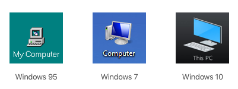
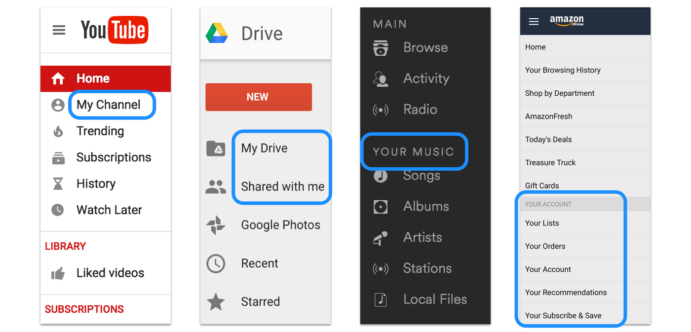
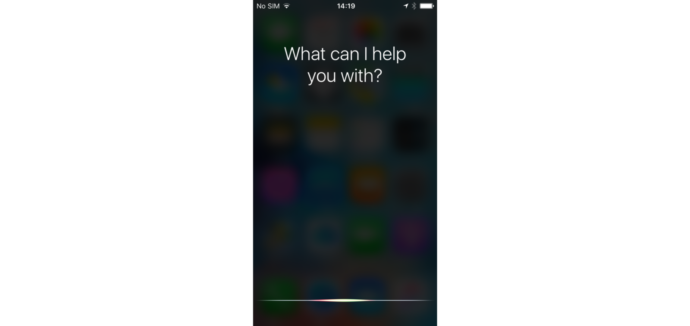
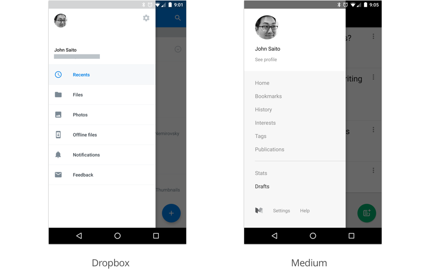
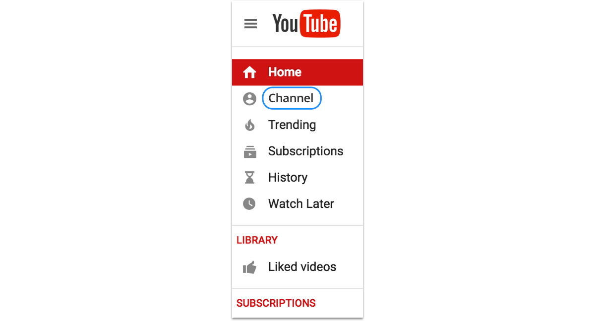
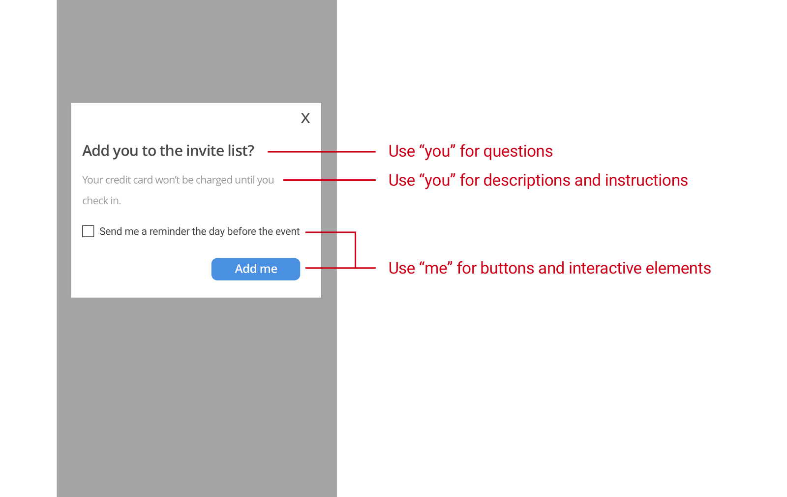
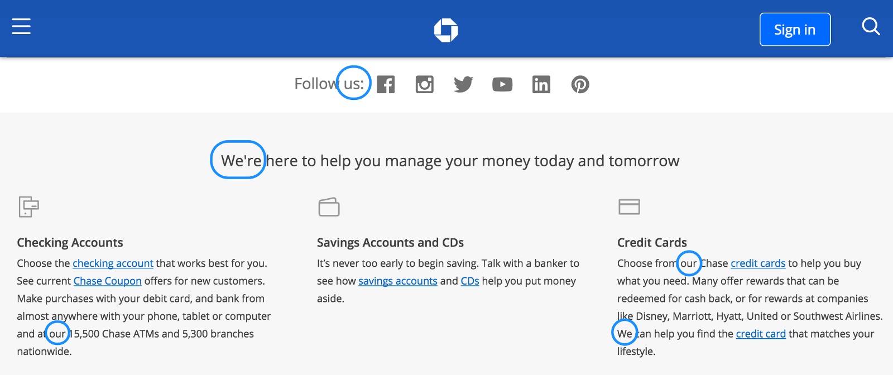

## 「我的电脑」的进化

还记得以前 Windows 上的「我的电脑」图标吗？它是一个了不起的小图标，它代表了你电脑上所有的东西——你所有的程序，所有的工作，所有的数字作品。

在后来的 Windows 版本中，微软将这个图标的名称改为「计算机」，最后又改回「此电脑」。他们改变名称是因为「我的」有误导性吗？还是不一致？没必要？

这个小改变促使我思考一个大问题：为什么产品有时候称呼某个东西为「我的 XX」，有时候又称呼「你的 XX」？

## 你怎么称呼你的东西

当你从一个应用切换到另一个应用，你会发现，界面中没有标准的方式来称呼属于你的东西。有些应用显示「我的 XX」，有些应用显示「你的 XX」。

如果你正在设计一个界面，称呼某个东西是从用户的视角还是产品的视角？我认为它们有微妙的区别，这取决于你想让你的用户在使用产品时拥有何种感受。

## 「我的」视角

在界面中使用「我的」，它意味着产品是用户的扩展，好像产品被打上一个标签以代表用户。「我的」让你觉得它属于你，你可以定制并控制它。

按照这种逻辑，当你想强调隐私、个性化或者所有权时，使用「我的」，可能更合适。也许这就是为什么「我的电脑」使用了很多年的原因，那时的电脑几乎总是单人使用，人们通常不会共享文件，他们所有的东西都在那个小图标里面，感觉很安全。

_我的，都是我的_

## 「你的」视角

在界面中使用「你的」，它意味着产品正在与你交谈，就好像这个产品是你的私人助理，帮助你完成某件事情。「这是你的音乐。这是你的订单。」

按照这种逻辑，当你希望你的产品听起来像是在谈话时，使用「你的」，可能更合适——就好像它在帮你完成一些任务。无论是支付账单，安排预约，还是填写税单，许多产品都能帮助人们更快、更聪明、更容易地做事情。

如今，电脑和各类应用甚至成为个人助理的角色，比如苹果的 Siri，亚马逊的 Alexa，微软的小娜。它们帮助你记笔记，提醒你买牛奶，大声为你朗读邮件。

_嘿，Siri，你能给我孩子换尿布吗？_

许多不同种类的应用，包括 Medium，都会给你主动推荐内容。在我看来，这就像一个私人助理为我挑选今天要读的故事一样。我认为这种趋势会越来越普遍，我们可能会看到越来越多的应用使用「你的」，而不是「我的」。

## 中立视角

跟设计中的大多数东西一样，没有一个万能的解决方案可以适用于任何情况。但是现在许多产品做的一件事就是在给属于用户的东西贴标签的时候，直接删掉「我的」或「你的」这样的词汇。

_这里没有提到「我的」或「你的」_

也许把「我的」略去这个做法，和 Windows 把「我的电脑」改为「此电脑」出于同样的考量。

不幸的是，删除「我的」或「你的」并不能解决所有问题。有时候你真的需要区分用户的东西和他人的东西。比如，在 YouTube 上，你不能仅仅说「频道」，因为不清楚这是指你的频道，你订阅的频道，还是 YouTube 推荐给你的频道。

_在这种情况下，仅仅使用「频道」是不够的_

也许，仅仅是也许，这就是为什么 Windows 最终将「计算机」改成了「此电脑」。因为「计算机」这个称呼太模糊了，他们需要明确他们指的就是「此电脑」。

## 整体视角

到目前为止，我主要讨论的是界面中属于你的东西。这只是你作为一个用户会遇到的单词的一小部分，其它还有比如按钮、说明书、设置等等，都有同样的问题。

对于这个问题，有很多不同的观点，但是下面列出的是我乐于遵循的一般指导方针。

- **何时用「我的」**  
  当用户与产品交互时，如点击按钮或选择复选框时，使用「我」，「我的」。但是只有在你需要非常明确表达你的意思时，才添加这个单词。
- **何时用「你的」**  
  当你的产品向用户提出问题，给出指示或描述事物时，使用「你」，「你的」。想象一下一个私人助理会说些什么。

## 「我们」的视角

在我结束之前，我不得不提另一种非常普遍的视角：「我们」，也就是在产品界面使用 “we”，“our“ 或 ”us“。

_大通银行的主页_

通过使用「我们」，他们实际上增加了第三个参与者——产品背后的人。这表明是真人在做这项工作，而不仅仅是一堆冰冷的机器。

如果你的产品销售人工服务，比如烹饪、设计、清洁之类，「我们」这个称呼会增加不少人情味。「我们是来帮忙的」，「看看我们的服务」。用户知道服务窗口后面是真人在那里，会感到更轻松。

另一方面，如果你的产品是一个像谷歌搜索引擎一样的自动化工具，「我们」这个称呼就会造成误导，因为没有真人来处理你的搜索请求。事实上，谷歌在用户界面指南里给出建议，在他们产品的界面上，对大多数事情都不要说「我们」。

## 你的观点是什么

我之所以写下这个故事，是因为我看到设计师、开发者和文案作者一次又一次地提出这个问题。为什么这里使用「我的」？而那里又使用「你的」？然而，我很少在公开的样式指南中看到这些内容。

你是否有自己的指导方针来处理界面中的描述视角？如果是这样的话，我很乐意听听你的观点。

原文：[Is this my interface or yours?](https://medium.com/@jsaito/is-this-my-interface-or-yours-b09a7a795256)
