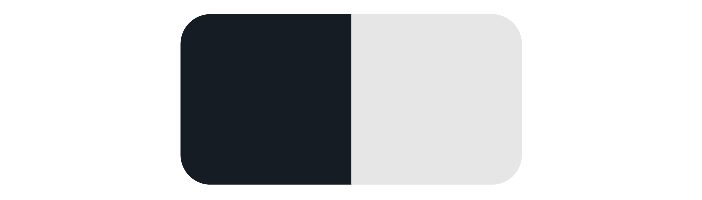
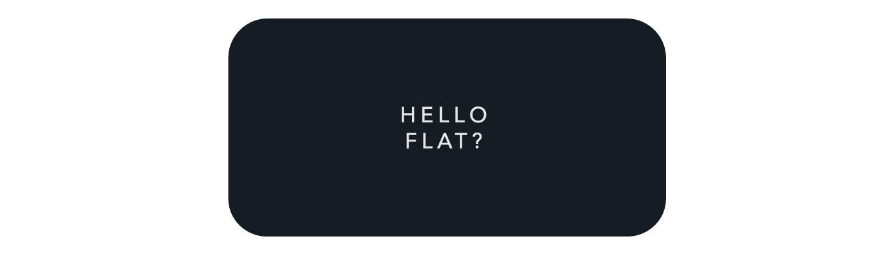

当我意识到把我的设计用代码写出来需要多少小花招时，我就失去了兴趣。看似简单的问题可以通过很多种方式解决，但它仍然可能无法在某些浏览器上运行。

我奇怪的是为什么设计和代码间存在鸿沟。为什么困难的事变得更简单，但简单的事变得更困难？

因此，不要争论设计师是否应该学习编码或开发人员是否应该学习设计，而是让我们就如何进行 Web 设计以及如何弥合编码和设计之间的鸿沟设置一些共同的基础。

## 网页设计的黑暗时代（1989 年）

网页设计的最初阶段非常「暗」，因为屏幕实际上是黑色的，并且其中只有很少的单色像素，设计通过符号和制表符（Tab 键）进行。因此，让我们快速前进到上网冲浪使用图形界面的时代——狂野西部的表格布局时代。

## 表格布局——开头（1995 年）

可以显示图像的浏览器的诞生是我们所知道的网页设计的第一步。跟结构化信息最接近的选择是 HTML 中已经存在的表格概念，把表格嵌套，找出巧妙的方法把静态单元格和动态单元格混合，这是由大卫·西格尔《创造杀手级网站》一书开始的。尽管使用表格来布局不是完全正确的做法（表格的本意是用来显示结构化的数字信息），但很长一段时间内，它仍然是网页设计的常用方法。另一个问题是难以维护这些脆弱的结构。

正是在这段时期，术语`切片设计`开始变得流行。设计师会做出一个奇特的布局，开发人员需要将其分解成小块并找出最佳方法来实现设计。另一方面，表格布局具有一些非常出色的功能，比如垂直对齐，用像素或百分比定位的能力。最主要的好处在于它是当时最接近网格布局的方法，这也是许多开发人员决定不再喜欢前端编码的时候。

## JavaScript 拯救世界（1995 年）

JavaScript 突破了 HTML 的局限。例如，需要一个弹出窗口或动态修改某些内容的顺序吗？答案是使用 JavaScript。然而，JavaScript 的主要问题是需要单独加载。它通常被懒惰的开发人员当作一个简单的补丁来使用，但如果聪明地使用它则会非常强大。如今，如果 CSS 提供相同的功能，我们宁愿避免使用 JavaScript。
JavaScript 在前端（jQuery）和后端（Node.js）都能工作得很好。

## 自由的黄金时代——Flash（1996 年）

为了打破现有网页设计的局限，一种新技术诞生了，它带来了前所未有的自由。设计师可以在 Flash 中设计任何形状、布局、动画、交互，使用任何字体。最终结果打包为一个文件，然后发送到浏览器进行显示。也就是说，只要用户拥有最新的 Flash 插件并且利用一些空闲时间等 Flash 文件加载完，它就能像魔术一样开始运行。这是启动页面，介绍动画，各种交互效果的黄金时代。不幸的是，这个技术不够开放，搜索不友好，而且性能不佳。当苹果决定在第一部 iPhone（2007 年）中放弃对 Flash 的支持时，Flash 就开始衰败，至少在网页设计领域如此。

## CSS（1998 年）

和 Flash 同时，从技术角度出发构建设计的更好方法诞生了——层叠样式表（CSS）。其基本概念是把内容和样式分离，外观和格式在 CSS 中定义，内容在 HTML 中定义。CSS 的第一个版本远远不够灵活，但最大的问题还是浏览器支持不够。花了好几年的时间，浏览器才全面支持 CSS，且仍然 bug 不断。这个时期经常发生的事情是某个浏览器有一个新功能，但别的浏览器没有，这对开发人员来说是一场噩梦。需要说明的是，CSS 不是一种编程语言，而是一种描述语言。

设计师需要学习编码吗？也许。设计师需要理解 CSS 的工作原理吗？绝对！

## 移动起义——网格和框架（2007 年）

在手机上浏览网页带来一系列的挑战，除了不同设备有不同布局外，内容的差异也是一个问题——在小屏幕上是否展示相同内容还是舍弃部分内容？所有那些漂亮、闪烁的小广告放在小屏幕的什么位置？速度也是一个问题，此外，加载大量内容会耗费很多流量，花费不菲。改进的第一步是引进网格的概念，经过几次迭代后，960 网格系统获胜，12 列分区成为设计师每天都在使用的东西。下一步是标准化常用元素，如表单、导航、按钮，并以简单可重复的方式打包它们，基本上，就是创建一个可视的元素库，需要的代码都已经封装在里面。现在流行的库是 Bootstrap 和 Foundation，对它们的使用导致网站和应用程序之间的界限变得模糊。

框架的缺点是所有的设计通常看起来一个样，而且设计师如果不知道代码如何工作，则仍然无法使用它们。

## 响应式网页设计（2010 年）

一位名叫 Ethan Marcotte 的聪明人决定挑战现有的方法，提出使用相同的内容，但设计的布局不同，并创造了「响应式网页设计」这一术语。从技术上讲，我们仍然使用 HTML 和 CSS，因此这个提法只是概念上的进步。然而，这里有许多误解。对设计师而言，响应式意味着模拟多个布局。对于客户端，意味着可以在手机上运行。对于开发人员来说，则要考虑图片的提供方式、下载速度、语义化、移动优先还是桌面优先等等。响应式的主要好处是内容平等，这意味着同一个网站可以服务多个场景。希望我们至少在这点上达成一致。

## 扁平化（2010 年）

设计更多的布局需要更多的时间。幸运的是，我们决定回归设计的根源，通过放弃花哨的阴影效果和优先考虑内容来提高效率。精美的图片，良好的排版，清晰的插图，考究的布局是我们现在的设计方式。简化视觉元素或所谓的「扁平化设计」也是该过程的一个部分。主要好处是更多的想法被融合到文本、消息层次结构以及一般的内容中。有光泽的按钮被图标取代，这使得我们可以使用矢量图像和图标字体。Web 字体提供了漂亮的排版。有趣的是，网络从一开始就差不多是这个样子，这就是年轻人的时代。

## 美好的未来（2014 年）

网页设计努力追求的目标实际上是将其视觉化并带入浏览器中。想象一下，设计师只需要在屏幕上移动东西，就会出现干净的代码。我不是指改变事物的顺序这种，而是具有充分的灵活性和控制力！想象一下，开发人员不必担心浏览器兼容性，可以专注于解决实际问题！

从技术上讲，有一些新概念支持朝着这个方向迈进。CSS 中的新单位如 vh，vw（视口高度和宽度）允许更大的灵活性来定位元素。它也将解决困扰这么多设计师的问题——为什么 CSS 中垂直居中如此痛苦。Flexbox 是另一个很酷的概念，它是 CSS 的一部分。它允许创建布局并使用单个属性修改它们，而不是编写大量代码。最后，Web 组件是一个更大的想法。它是一组捆绑在一起的元素（如图库、注册表单等）。这引入了一个更简单的工作流，其中组件成为可以单独重用和更新的构建块。

你对网络的未来有何看法？

原文：[A brief history of web design for designers](http://blog.froont.com/brief-history-of-web-design-for-designers/)

---

注意：括号中的年份表示开头。随着时间的推移，这一切都以不同的速度发展。因此 1998 ～ 2007 年根本不是空白，而是发生演变的地方。
