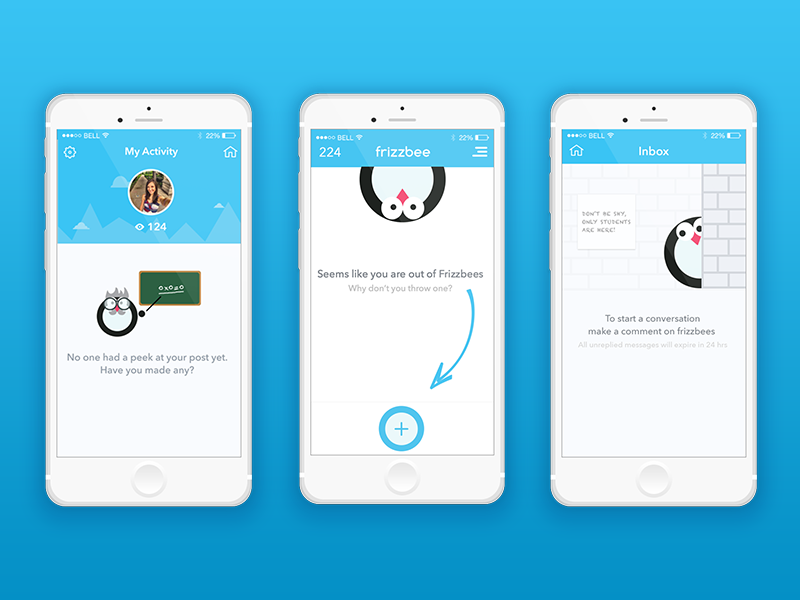

UX（用户体验）文案是一项设计工作。为什么？因为优秀的文案设计和优秀的视觉设计一样重要。是的，我说视觉设计，其实就是指你的 UI（用户界面）。因此，当我在一般意义上讨论设计时，我意指优秀的 UI、优秀的 UX、当然还有文案，它们的混合体。试想一下，当你给不出一个有效的 call-to-action（操作要求）时，设计一个超酷的按钮有什么意义？你的用户会点击这样的按钮吗？我不确定。

还不相信吗？花几分钟看看下面这些具体的原因，它们解释了**为什么**在用户体验设计中要注重文案。基于同样的理由，我建议你最好雇佣一个 UX 导向的文案作者。或者，你可以尝试自行草拟你产品的 UX 文稿，然后把它交给一个有经验的文案作者进行微调。

## 因为文案作者在某种意义上是设计师

设计师推敲颜色、形状、图标，以创建优秀的 UI/UX，文案作者推敲用词、句子结构，以创建精彩的文案。让我们看一些例子：

设计师和开发者更简洁，文案作者更具表现力和描述性，他们通常可以用文字来帮助解决设计问题。

## 因为良好的 UX 文案有助于保持一致性

文案在用户体验设计中不仅意味着增加对设计的感受，它还意味着保持各种产品元素间的一致性。举例来说，文案作者能看到全局，并可填补缺失的部分，使用户体验更加全面。

就像设计师一样，优秀的文案作者为不同的产品创建自己的风格指南并坚持下去。

例如，你永远不会看到「哎呀，出了点问题」和「应用程序遇到一个未知错误」这两句话在同一个产品中出现。虽然这两个文本具有相同的含义，但它们在风格上非常不同。一个优秀的 UX 文案作者永远不会把它们放在一个产品中。

## 因为文案作者擅长语法和标点符号

用户体验写作还涉及到细节问题。在一个优秀的 UX 文案中，你几乎找不到错误的逗号或拼写错误的单词。文本的质量是文案作者关注的首要问题。

如果你问过语言是否重要，我肯定会说是。因为许多用户可能会因为在应用中看到拼写错误或不一致而感到不安。这一切都归结为信任。一旦他们开始注意到低质量的写作，他们可能会放弃这个应用。

## 因为写作可以让你回答以前从未遇到过的设计问题

通常，我们知道我们理解了某些东西，我们能够解释给其它人听。产品设计也是如此。有时，产品/UX 作者可能会发现难以解释的功能。然后他们会要求设计师解释它。实际情况是，有时几乎不可能解释一个功能。你认为这意味着什么？是的，设计不够直观。因此，你只需简单地回到设计并开始改进它，而不是折磨文案作者。

因此，你可以看到，UX 写作甚至可以提出可用性问题，并能让你想出一个更简单的解决方案。

原文：[Why is UX Copywriting so Important in Product Design](https://uxplanet.org/why-is-ux-copywriting-so-important-in-product-design-85826b42d1b4)
