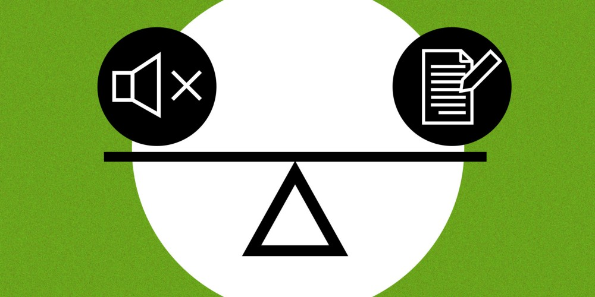

想象一下这个画面，一间屋子里满是 Square 的高管，他们受邀参加一场重要的评审会。所有人都沉默地盯着电脑，房间里键盘的咔哒咔哒声不断。30 分钟后，谈话开始。

到底怎么回事？大家都在等着会议开始吗？他们正在练习某种形式的静默撤退吗？

其实，这就是我们的工作方式。Alyssa Henry，我们的销售副总，从亚马逊借鉴了这种开会方式，改进后在内部推广开来。核心是，参会者不出声，阅读 Google Doc 里的文档，用 Google Doc 的评论功能提问和回答。30 分钟后，我们已经确定了需要亲自讨论的要点，这样接下来的交谈就会简短并且重点突出。更重要的是，我们给了每个人机会让他人听到他的意见。如她下面所说，我们正在建立一种文化，在这个文化中，想法可以被说出来（或写出来——视场景而定），而不用担心被他人打断。

Alyssa 写出了这个做法背后的原因，并且允许我在这里共享出来。

**为何在会议中使用 Google Docs 进行阅读/评论而取代幻灯片？**

短回答：

> 包容，透明度，可扩展性和速度

长回答：

> 大量研究表明，少数族裔、女性、偏远员工、内向者在会议中经常被打断，并且/或者很难在传统的会议文化中听到他们的声音。它不仅对那些被传统方法剥夺权力的人来说很糟糕，对那些无意打断/关闭对话的人很糟糕，对那些想听最好的想法却不能的领导也很糟糕，因为人们通常被无意地关闭了对话通道。
>
> 我想创建一种文化，在这个文化中，想法可以被说出来（或写出来——视场景而定），而不用担心被他人打断。我希望的文化是这样的：不是音量最大的人、滔滔不绝的人或旧金山本地人掌握了话语权，而应是最正确的人获得话语权。我希望有广泛的意见——并且引起辩论。从一个领导者自私的角度出发，我希望能听到不同的意见，所有的想法都经过讨论和考量。
>
> 通过写下东西，更容易与更广泛的受众分享，并且更容易通过评论听到所有「声音」，它是可扩展的。你们都可以看到公司内部双季度的讨论文档，你不仅可以阅读与会者阅读的所有内容，还可以看到所有的问答。这意味着即使你没有参加会议，你也可以添加评论或回复评论。这是一个更广泛的受众参与和贡献的机会。它的目的是赋予权力。有了幻灯片，你不会听到谈话过程、问答，也不会有机会回答或添加评论。而有了文档，你就有这个机会，即使在会议之后。
>
> 我们都有不同的兴趣——甚至在 Square 内部也是如此。我想快速前进、暂停或倒退的内容可能与你想要快速前进、暂停或倒退的内容不同。幻灯片不能使这种兴趣或速度多样化。它们缓慢、单调。我们的时间是我们所有人最宝贵的东西。我希望，我们所有人都能把时间关注和贡献在那些我们感兴趣和重要的事情上。这就是团队合作的意义所在。我们不尽相同，也不应该如此。

我第一次参加这样的会议时，感觉有点奇怪，但是我很快意识到我们在相同时间里完成了更多的工作。这在任何类型的小组评审中都很有效。你可以试一试。

原文：[A silent meeting is worth a thousand words](https://medium.com/square-corner-blog/a-silent-meeting-is-worth-a-thousand-words-2c7213b12fb6)
