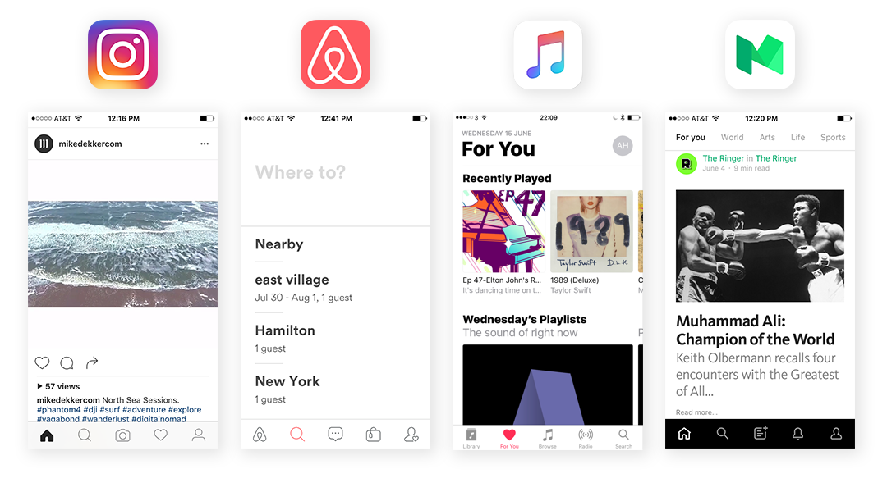

打开 Instagram、Airbnb、Apple music、Twitter、Dropbox 或 Lyft，乍一看，你可能无法区分，外观都是一样的风格：圆润的非衬线字体的粗大标题，充满大量负空间的黑白界面，几乎没有颜色。

现代风格的界面感觉如此赤裸直白。具有讽刺意味的是，许多最流行的应用给人的感觉是它们实际上根本就没有设计。

Instagram 去掉了深蓝色的头部，Lyft 应用中鲜艳的粉红色不见了。最大的技术品牌是否忘记了他们的品牌？或者它们只是套用了相同的模板？

此外，有明显的迹象表明，Google 也在加入这个无色的趋势。今年，Google 对其 Material Design 设计规范进行重大改革，并发布了一个重新设计的 Gmail 预览。

猜怎么着？它看起来和别的品牌一样。大多数标志性的红色界面元素已经完全消失（比如红色的顶部），我们看到更多的白色：白色底条，白色浮动操作按钮，白色输入框，白色背景。

我们都知道，硅谷倾向于窃取彼此的想法，但在过去十年（至少）设计一直是各品牌区别的关键。这种设计一致性的趋势似乎非常违反常理。

到底发生了什么事？

嗯，我认为产品设计的统一性是件**好事**，这里有几个原因。

## 更多地关注内容和结果

应用程序疲劳是一件真实的事情。大多数人已经厌倦了在太多的应用程序之间折腾，或在下载一个新应用后重新学习如何使用。

接近四分之一的应用仅在使用一次后就被删除。研究表明，大多数人都有几个最常使用的应用——可以节省时间或金钱（或两者兼而有之），让生活更轻松。随着日常数字产品的统一性，设计者可以把更多的精力聚焦在产品功能上。

诺曼——以“UX”这一术语而闻名——阐述得最好：

> 界面的真正问题是它是一个界面。界面会碍事。我不希望把精力浪费在关注界面上，我希望专注于工作本身...不去想我正在用一台电脑，而是想我正在做我的工作。

## 更多的一致意味着更好的可用性

你还记得上次是什么时候，你尝试在网上买东西，但没有立即扫描屏幕右上角到达购物车？几乎所有电子商务网站都遵循的标准化设计约定，意味着人们不需要重新学习如何购物。

大多数应用中的设计规范被用户所接受，不幸的是，其间的差异会让用户感到混乱和挫折。

以 Snapchat 为例，今年早些时候发布了一个有争议的设计更新。这是一个非常规设计——里面充斥胡乱堆放的功能并改变了导航模式——用户好感几乎是立刻下降了 73%，用户数和股价也随之下跌。

正如 Snapchat 所证明的那样，设计一些新颖的东西是有风险的。但是一致的设计（即使竞争对手也在用）却可以降低用户的烦恼几率。

## 品牌不只是它看上去如何，而是它用起来如何

卓越的用户体验来自出色地解决了用户的需求和意愿。用户体验上的差别是无形的，但毫无疑问，对一个品牌的价值要超过外观和感觉的差别。

诚然，外观是重要的，在用户体验上也发挥了很大的作用。当人们发现视觉上有吸引力时，他们会更加宽容并且忽略令人困惑的界面。

但设计师的精力应该花在创造更好的方式让人完成任务，而不是绚烂的颜色和神奇的动画。设计好的产品，对用户有价值的产品，需要无休止地反复测试、多次迭代，才能做到有用和可用。

奥巴马，乔布斯，扎克伯格，他们都因为每天穿同样的衣服而出名。原因是心理学家所说的**决定疲劳**。他们每天都要用有限的能量来做大量的决定，在诸如穿什么之类的小事上就不要再浪费精力了。

设计师应该用样的方式分配他们的能量。随着界面设计趋向一致，设计师可以花更少的时间去担心用什么颜色，或按钮应该多大，以及为什么它应该放在首位。

## 界面设计的趋同不会扼杀创造性

现在，我知道你在想什么。是的，你喜欢的应用看起来都一样带来的负面影响是，它们会减少创造力和创新，老实说，我承认这是真的。

但是，即使每个产品设计师都加入剥离界面的运动，仍然有许多有意义的设计工作要做。

实际上，设计上的雷同不仅对短期来说是有益的（希望我已经解释了为什么），长期来看，甚至会带来更大的影响。

一方面，增强现实和人工智能的增长，我们与计算机的交互可能变得更加无形；屏幕正在萎缩，手势变得越来越熟悉，我们比以往任何时候更多地采用无屏幕的方式来讨论或聊天。

即使是 iPhone，虽然有着漂亮的屏幕和良好的交互设计，我也更多地选择使用 Siri 来完成我的日常任务，比如设置提醒，创建日历事件，选择音乐，发送消息和查询天气。我可能整天都不用屏幕，而不会对 iPhone 提供的实用工具有任何影响。或者，正如诺曼所言，我可以「完成我的工作」。

但是，对于设计师来说，还有很多工作要做，以改进 Siri 的设计。我并不是唯一这样想的人，Kévin Eugène 写了[一遍文章](https://uxdesign.cc/redesigning-siri-and-adding-multitasking-features-to-ios-70c2f1a1569b)来谈如何重新设计 Siri 的用户体验。

也就是说，甚至有更多的机会，考虑以新的、有创意的方式，将感官（超出视觉效果）、注意力、情绪或感知吸引进来。

把好设计限制在我们仅仅在屏幕上看到的，至少，破坏了我们梦想未来的可能性。

原文：[Ever wonder why the most popular apps are starting to look the same? It might be a good thing](https://uxdesign.cc/ever-wonder-why-the-most-popular-apps-are-starting-to-look-the-same-it-might-be-a-good-thing-e54aadd50fd5)
