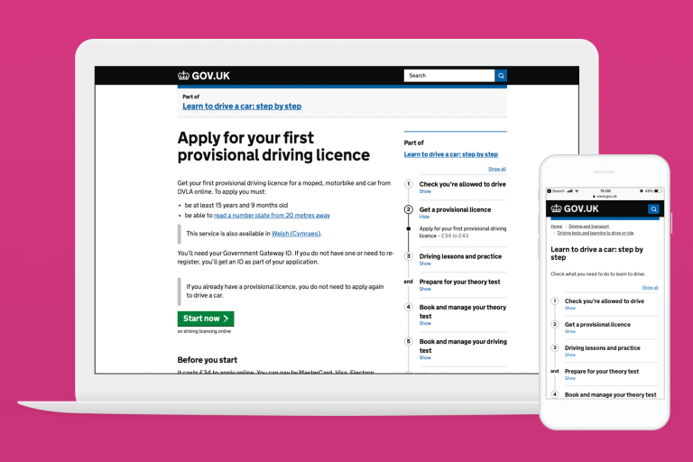
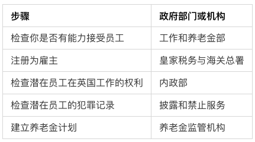
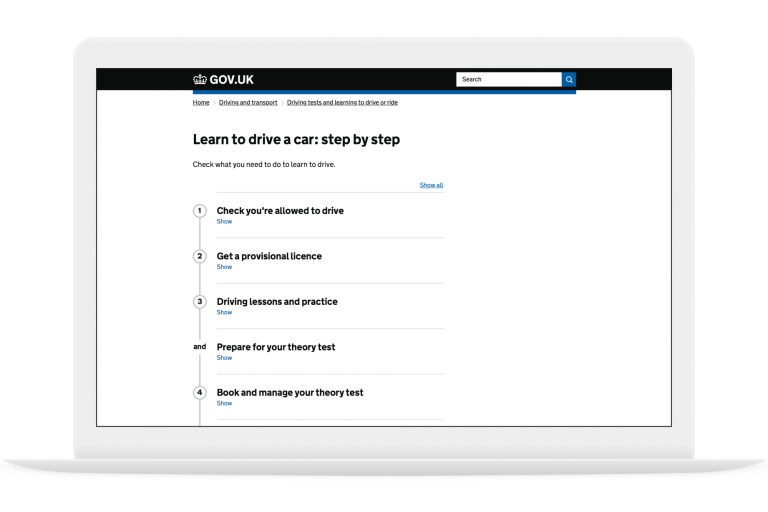
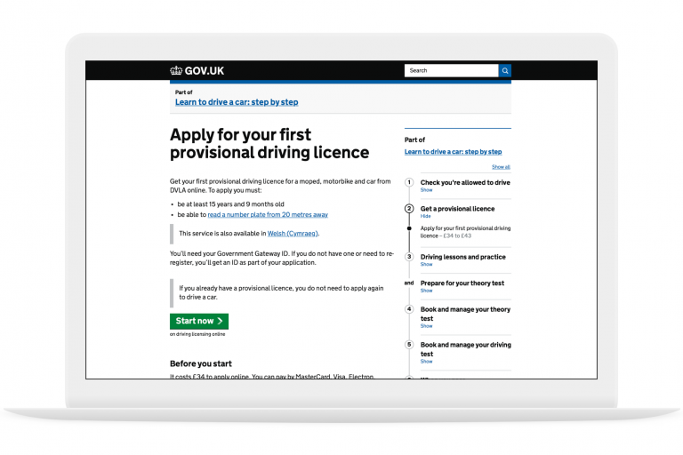
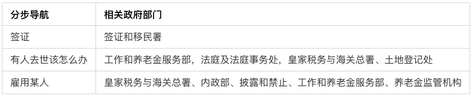

_申请你的第一张临时驾驶执照，分步导航页面_

自 GOV.UK 6 年前推出以来，它一直是政府在线内容的所在地，也是在线服务的起点。

每周都有数百万人使用 GOV.UK 来完成复杂甚至改变人生的任务，比如申请驾照、登记新生儿或创业。

我们希望通过简化内容和直观的操作让这些任务越简单越好。这对用户有好处，因为它可以帮助用户更快地完成任务。这对政府有利，因为它减少了不必要的流程和个案处理。

## 为什么我们需要全程服务？

我们知道用户完成一项任务面临很多挑战。为了开始一项任务，有许多信息需要处理。根据任务的不同，可能会有预约、填写表格、测试以及各种材料准备。

更困难的地方在于，每个步骤都需要在正确的时间按正确的顺序完成。

这就是为什么政府需要关注任务的每一步。从用户做的第一件事，到用户做的最后一件事。我们需要全程服务。

政府在努力实现这一目标时面临的困难是，人们的现实任务并不总是与政府部门和机构的组织方式完全吻合。

例如，企业想雇佣第一名员工，需要来自五个不同领域的政府信息和服务。

## 按主题和任务组织 GOV.UK

我们一直致力于围绕用户需求来组织内容，而不是围绕政府组织机构来架设 GOV.UK。因此，GOV.UK 上的内容现在被组织成以用户关注任务为中心，而不是按政府部门划分。

这种结构将为搜索和浏览网站提供新的方法，使查找更容易。

但我们希望做得更好——让用户用起来更方便。

大约一年前，我们开始尝试用户导航 GOV.UK 的新方法。这些试验演变成现在称之为「分步导航」的方式。

它看起来像这样：

_本页概述了学习驾驶汽车的过程_

上图展示的是如何学习驾驶的步骤

这意味着，从一开始，我们就可以向用户展示他们完成某项任务所需要做的所有事情，无论是学习驾驶还是雇佣某人。

导航指示会全程帮助你，告诉你现在和将来要做什么。它还会向你展示你可能错过的先前步骤。比如，在预订驾驶理论考试之前要获得临时驾驶执照。

_分步导航始终在页面右侧给予提醒_

GOV.UK 上所有类型的内容和办事流程都采用了分步导航的设计，在适当的情况下，可以使用单独的任务列表模式进一步细分办事流程。

## 设计过程

该设计经过 8 轮迭代和优化，包括在 Neath 著名的「数字无障碍中心」进行深入审查。

在实验中心审查过半的时候，我们开始测试效果如何。分析数据显示，分步导航的第一个示例获得了大量流量，比如，学习驾驶这个任务，前 6 个月被使用了 124 万次。

我们请求用户提供「此页面有用吗？」的反馈。调查横幅位于网站每个页面的底部。这表明用户发现它很有用。

我们还进行了一项远程用户研究，我们要求用户在分步导航之前和之后完成一系列任务。

该研究表明，分步导航导致用户成功完成任务的人数大幅增加，并且对使用 GOV.UK 找到所需内容的信心增强。

## 扩展方法

随着令人鼓舞的数据反馈，在过去的 6 个月中，我们一直在努力扩展这种方法，以便它可以帮助用户完成更复杂的任务。包括如下这些：

如该表所示，要完成一件任务，涉及的内容通常跨越多个政府部门，我们需要一种协作方法，让用户使用起来更方便。为达到这一目的，为跨部门的任务创建新流程和设计新的导航方式同样重要。

在过去的 6 个月里，我们与超过 15 个不同的部门合作，共同发布了 25 个分步导航任务。

我们还要感谢驾驶和车辆标准局的团队，在我们的工作还处于原型阶段时，他们帮助我们制作了第一批导航任务：学习驾驶和成为驾驶教练。他们还写了一篇精彩的博客记录了这一过程。

## 下一步

我们将继续与各部门合作，对政府内部高优先级和高复杂的用户任务进行逐步导航。同时，我们将密切关注性能指标，以确保此方法仍然适用于用户。
